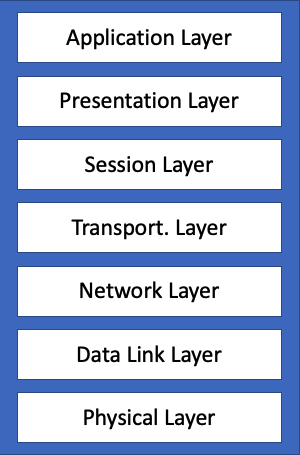
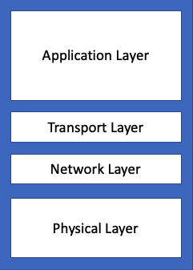
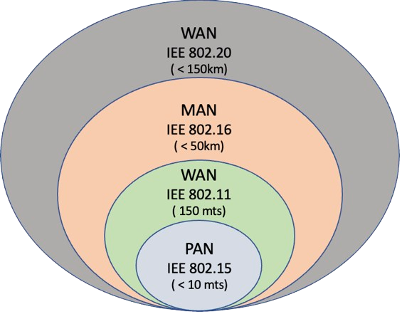
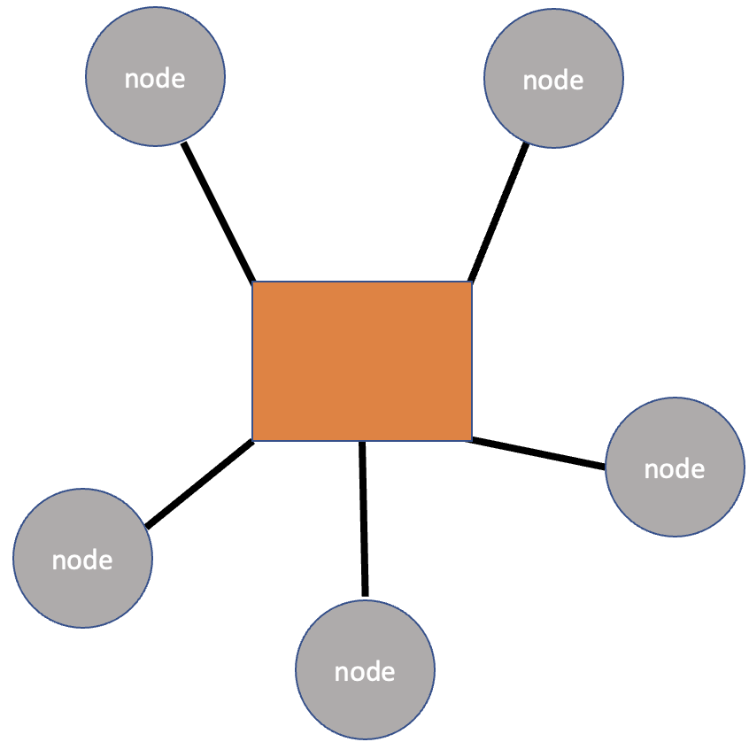
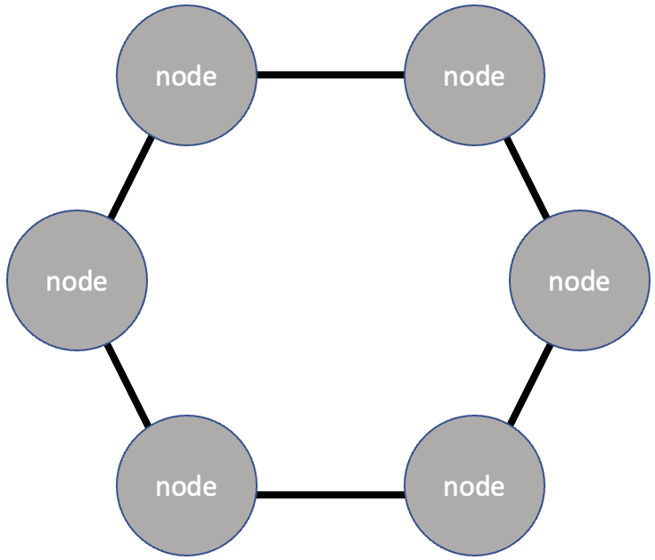
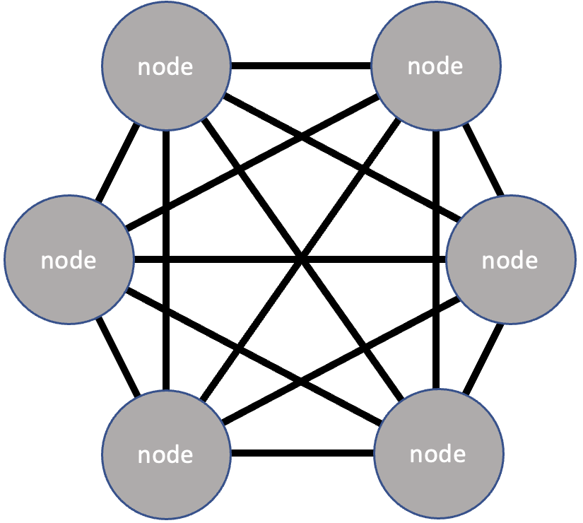

# 네트워크

# 네트워크 개요

## 네트워크의 정의와 필요성

**네트워크**

- **정의**: 통신 및 데이터 교환을 용이하게 하기 위해 함께 연결된 컴퓨터, 서버, 라우터, 스위치 및 기타 네트워킹 장비와 같은 상호 연결된 장치의 모음

- **네트워크의 필요성**
  - 프린터 등의 공유 자원을 사용하기 위함
  - 이메일, 채팅, 화상 회의 등의 정보 교환을 위함
  - 서버의 데이터에 접근하기 위함

## 데이터 통신의 기본 구성 요소

### 송신자(Sender), 수신자(Receiver), 메시지(Message), 전송 매체(Medium), 프로토콜(Protocol)

**송신자(Sender)**

- **정의**: 데이터 메시지를 전송하는 장치
- **특징**: 데이터를 전송하기 위해 적절한 포맷으로 변환함
- **예시**: 이메일 작성자, 서버에서 데이터를 전송하는 애플리케이션

**수신자(Receiver)**

- **정의**: 송신자가 보낸 메시지를 받는 장치
- **특징**: 데이터를 수신하고 이를 적절히 표현하거나 저장함
- **예시**: 이메일 수신자, 서버에서 데이터를 처리하는 애플리케이션

**메시지(Message)**

- **정의**: 송신자가 보내는 실제 데이터
- **특징**: 텍스트, 이미지, 비디오 등 다양한 형태임
- **예시**: 이메일 본문, 데이터 패킷

**전송 매체(Medium)**

- **정의**: 송신자에서 수신자로 이동하는 물리적인 경로
- **특징**: 유선, 무선 또는 혼합 형태로 구현 가능함
- **예시**: LAN 케이블, Wi-Fi

**프로토콜(Protocol)**

- **정의**: 컴퓨터나 원거리 통신 장비 사이에서 메시지를 주고 받는 양식과 규칙의 체계
- **특징**: 데이터의 형식, 순서, 오류 처리 등을 정의함
- **예시**: HTTP/HTTPS, TCP, DHCP

## 네트워크 모델 (Network Models)

### OSI 7계층 모델
  
  > OSI 7 Layers
- **정의**: 국제표준화기구(ISO)에서 개발한 모델로, 컴퓨터 네트워크 프로토콜 디자인과 통신을 계층으로 7단계로 나누어 설명한 것임

**물리 계층 (Physical Layer)**

- **정의**: 장치 간 전기적 신호를 전달하는 계층으로, 데이터 프레임 내부의 각 bit를 한 노드에서 다음 노드로 실제로 이동시키는 계층임
- **특징**: 
  - 통신 데이터의 단위는 Bit
  - 디지털 신호를 전기적인 신호로 변환하여 주고받는 기능 수행함
  - 주요 프로토콜은 RS-232, X.25/X.21
  - 관련 장비로는 케이블(Cable), 리피터(Repeater), 더미허브(Dummy Hub)

**데이터 링크 계층 (Data Link Layer)**

- **정의**: 물리 계층을 통해 송수신되는 정보의 오류와 흐름을 관리하여 안전한 정보의 전달을 수행할 수 있도록 도와주는 역할을 하는 계층임
- **특징**: 
  - 통신 데이터의 단위는 Frame
  - MAC 주소를 이용하여, hop-to-hop 방식으로 물리계층에서 받은 정보를 전달함
  - 주요 프로토콜은 Ethernet, HDLC(High-Level Data-Link Control), PPP(Point-to-Point Protocol)
  - 관련 장비로는 L2 스위치(Switch), 브릿지(Bridge)

**네트워크 계층 (Network Layer)**

- **정의**: 경로를 선택하고 주소를 정하고 경로에 따라 패킷을 전달해주는 역할을 하는 계층임
- **특징**: 
  - 통신 데이터의 단위는 Packet
  - 라우팅, 트래픽 제어, 패킷 정보 전송 등을 수행함
  - 주요 프로토콜은 IP(Internet Protocol), ICMP, RIP
  - 관련 장비로는 라우터(Router), L3 스위치

**전송 계층 (Transport Layer)**

- **정의**: 데이터 전송의 오류 검출, 수정 및 흐름 제어를 수행하는 계층임
- **특징**: 
  - 통신 데이터의 단위는 Segment
  - 오류검출 및 복구, 흐름제어와 중복검사 등을 수행함
  - 주요 프로토콜은 TCP(Transmission Control Protocol), UDP(User Datagram Protocol)
  - 관련 장비로는 게이트웨이(Gateway), L4 스위치

**세션 계층 (Session Layer)**

- **정의**: 응용 프로그램 간의 대화를 유지하기 위한 구조를 제공하고, 이를 처리하기 위해 프로세스들의 논리적인 연결을 담당하는 계층임
- **특징**: 
  - 통신 데이터의 단위는 Message
  - 통신을 하기 위한 세션 확립, 유지, 중단을 수행함
  - 주요 프로토콜은 RPC(Remote Procedure Call), NetBIOS

**표현 계층 (Presentation Layer)**

- **정의**: 애플리케이션이 다루는 정보를 통신에 알맞은 형태로 만들거나, 하위 계층에서 온 데이터를 사용자가 이해할 수 있는 형태로 만드는 역할을 담당하는 계층임
- **특징**: 
  - 통신 데이터의 단위는 Message
  - 데이터를 응용, 세션 계층에 보내기 전에 변환함
  - 주요 프로토콜은 SSL(Secure Socket Layer), ASCII(American Standard Code for Information Interchange)

**응용 계층 (Application Layer)**

- **정의**: 응용 프로세스와 직접 관계하여 일반적인 응용 서비스를 수행하는 역할을 담당하는 계층임
- **특징**: 
  - 사용자가 OSI 환경에 접속할 수 있도록 서비스 제공함
  - 응용 프로세스 간의 정보 교환, 파일 전송 등의 서비스를 제공함
  - 주요 프로토콜은 HTTP(HyperText Transfer Protocol), SMTP(Simple Mail Transfer Protocol)

### TCP/IP 모델
  
  >TCP/IP Model
- **정의**: 미국 국방성의 DARPA(Defense Advanced Research Projects Agency)에 의해 개발된 모델로, 컴퓨터 네트워크 프로토콜 디자인과 통신을 계층으로 7단계로 나누어 설명한 것임

**네트워크 인터페이스 계층 (Network Interface Layer)**

- **정의**: 물리적인 네트워크 매체를 통해 데이터를 전송하는 기능을 담당하는 계층임
- **특징**: 
  - 이더넷, Wi-Fi 등 다양한 LAN 및 WAN 기술을 지원함
  - 하드웨어 주소(MAC 주소)를 사용하여 네트워크 장치를 식별함

**인터넷 계층 (Internet Layer)**

- **정의**: 패킷의 라우팅 및 주소 지정을 담당하고, 서로 다른 네트워크 간의 데이터 전송을 가능하게 하는 계층임
- **특징**: 
  - 데이터를 패킷으로 분할하고, IP 주소를 사용하여 송수신지를 설정함
  - 주요 프로토콜은 IP(Internet Protocol), ICMP(Internet Control Message Protocol)

**전송 계층 (Transport Layer)**

- **정의**: 애플리케이션 간의 통신을 관리하고, 흐름 제어 및 오류 검출 기능을 하는 계층임
- **특징**: 
  - 데이터의 신뢰성 있는 전송 및 흐름 제어, 오류 검사를 담당함
  - 주요 프로토콜은 TCP(Transmission Control Protocol), UDP(User Datagram Protocol)

**응용 계층 (Application Layer)**

- **정의**: 사용자가 직접 상호작용하는 네트워크의 가장 상위 계층임
- **특징**: 
  - 네트워크 기반 응용 프로그램이 작동함
  - 주요 프로토콜은 HTTP(HyperText Transfer Protocol), FTP (File Transfer Protocol)

## 네트워크의 종류 (Types of Networks)

  >Types of networks

**LAN(Local Area Network)**

- **정의**: 근거리 통신망으로, 지역적인 범위에서 컴퓨터와 기타 장치들이 서로 연결되어 데이터를 공유하는 네트워크임
- **특징**: 
  - 조직내부나 동일 건물등 비교적 좁은 지역을 연결하기 위해 사용함
  - 관리자가 직접 관리하는 방식임
- **장점**: 
  - 내부 네트워크에서 전송 속도가 빠름
  - 내부적으로 네트워크 관리가 가능해 보안 제어가 용이함
- **단점**: 
  - 네트워크 확장이 제한적일 수 있음
  - 한 건물 또는 근거리 내에서만 작동함
- **활용 예시**: 
  - 사내 네트워크에서 파일 공유 및 프린터를 사용함

**WAN(Wide Area Network)**

- **정의**: 근거리 통신망으로, 지역적인 범위에서 컴퓨터와 기타 장치들이 서로 연결되어 데이터를 공유하는 네트워크임
- **특징**: 
  - 일반적으로 공공 통신 인프라를 통해 데이터 전송을 수행함
  - 수백 킬로미터에서 수천 킬로미터까지의 범위를 커버함
  - 위성, 전화선, 광섬유 등 다양한 전송 매체를 사용하여 연결됨
- **장점**: 
  - 도시, 국가 등의 넓은 범위를 연결함
  - 다양한 네트워크 연결 기술을 지원함
- **단점**: 
  - 설치 및 운영 비용이 상대적으로 높음
  - 속도가 느림
- **활용 예시**: 
  - 인터넷을 통한 이메일 송수신, 원격 사무실 연결

**MAN(Metropolitan Area Network)**

- **정의**: 특정 도시나 대도시 지역 내에서 여러 LAN을 연결하는 네트워크임
- **특징**: 
  - 일반적으로 수십 킬로미터 범위 내에서 운영됨
- **장점**: 
  - 도시 전체나 대규모 지역을 연결할 수 있음
  - 새로운 노드의 추가가 쉬움
  - WAN보다 낮은 비용으로 구축 가능함
- **단점**: 
  - 초기 구축 비용이 상당히 높음
  - 고급 장비에 의존하여, 장비 고장 시 전체 네트워크에 영향을 줌
- **활용 예시**: 
  - 도시 내의 기업 및 기관 간 연결, 대학 캠퍼스 네트워크

**PAN(Personal Area Network)**

- **정의**: 개인의 장치 간에 데이터를 전송하기 위해 사용되는 소규모 네트워크임
- **특징**: 
  - 일반적으로 개인이 소지한 장치 간의 연결을 의미함
  - 10~30m 정도의 짧은 범위를 커버함
- **장점**: 
  - 작은 범위에서 간단히 네트워크를 구성할 수 있음
  - 통신 과정에서 전력 소모가 낮음
- **단점**: 
  - 장치 간 호환성 문제가 발생할 수 있음
  - 동일 주파수 대역에서 작동하는 장치 간 간섭이 발생할 수 있음
- **활용 예시**: 
  - Bluetooth, Wi-Fi Direct, Zigbee

### WLAN(Wireless LAN), SAN(Storage Area Network)

**WLAN(Wireless LAN)**

- **정의**: 유선 연결 대신 무선 기술을 사용하여 로컬 네트워크 노드를 연결하는 근거리 통신망(LAN)의 한 유형
- **특징**: 
  - 무선 주파수(RF) 또는 적외선 기술을 사용하여 데이터를 공중으로 전송하고 수신함
  - 케이블 없이 디바이스를 네트워크에 연결함
  - 액세스 포인트(AP)를 이용하여 신호를 증폭하고 인터넷에 연결함
- **동작 방식**: 
  - 
- **장점**: 
  - 설치, 유지보수, 재배치가 간편함
  - AP를 이용해 쉽게 네트워크를 확장 할 수 있음
  - 어디서든 무선 네트워크를 사용할 수 있음
- **단점**: 
  - 무선 신호의 도청, 신호 스푸핑의 문제가 존재함
  - 유선 LAN보다 느리거나 연결의 안정성이 떨어짐
  - 다수의 사용자가 접속할 경우 네트워크 성능이 낮아짐
- **활용 예시**: Wi-Fi

**SAN(Storage Area Network)**

  >SAN의 통신 과정
- **정의**: 여러 컴퓨터와 서버가 공유할 수 있는 고속 전용 스토리지 네트워크
- **특징**: 
  - 일반 네트워크와 분리된 전용 스토리지 네트워크로 동작함
  - 스토리지 디바이스들이 네트워크로 연결되어 중앙화된 논리 볼륨을 형성함
  - 광섬유 채널(Fibre Channel) 등의 기술을 이용하여 고속 데이터 전송을 지원함
- **동작 방식**: 
  - 서버가 스토리지 장치에 데이터 요청을 보냄
  - SAN 스위치가 요청을 전달하고, 스토리지 장치에서 데이터를 검색함
  - 검색된 데이터를 서버로 고속 전송함
- **장점**: 
  - 블록 단위 데이터 전송을 지원하여 빠르고 안정적인 데이터 접근을 제공
  - 데이터 백업, 복구가 쉬움
- **단점**: 
  - 전용 장비와 인프라 구축 비용이 높음
  - 네트워크 설계를 위한 전문 지식이 필요함
  - 파일 공유가 제한됨
- **활용 예시**: 데이터 센터, 클라우드 서비스

## 네트워크 토폴로지 (Network Topology)

### 스타(Star), 버스(Bus), 링(Ring), 메시(Mesh), 트리(Tree)
**스타(Star)**

  >Star 형태의 네트워크 
- **정의**: 가장 흔하게 쓰이는 네트워크 토폴로지로, 네트워크 안의 모든 노드가 동축 케이블이나 연선 또는 광케이블을 통해 직접 하나의 중앙 허브에 연결된 형식
- **특징**: 
  - 중앙 노드는 서버로서 작동하여 데이터의 흐름을 관리함
  - 각각의 노드에서 보낸 정보가 목적지에 닿기 위해서는 반드시 중앙 노드를 지나야 함
  - 중앙 노드는 리피터처럼 데이터 손실을 막아줌

- **장점**: 
  - 한 장소에서 전체 네트워크를 관리할 수 있음
  - 각 노드는 독립적으로 연결되어 있어, 노드 하나의 장애가 발생해도 다른 노드는 운용 가능함
  - 장애가 발생한 경우 원인을 쉽게 찾을 수 있음

- **단점**: 
  - 중앙 허브에 문제가 생기면 전체 네트워크가 모두 멈춤
  - 전체 네트워크의 성능이 중앙 노드에 의해 결정됨

- **활용 예시**: 가정용 네트워크, 소규모 사무실 네트워크

**버스(Bus)**

  >Bus 형태의 네트워크 

- **정의**: 네트워크상의 모든 장치가 하나의 케이블로 연결되어 있는 유형
- **특징**: 
  - 네트워크의 한쪽 끝에서 다른 쪽 끝으로 한 방향으로 연결되어 있음
  - 데이터의 흐름이 케이블의 경로를 따라 한 방향으로 이동함

- **장점**: 
  - 구축 비용이 저렴함
  - 장치의 추가, 제거가 쉬움
- **단점**: 
  - 케이블에 장애가 발생할 경우, 모든 네트워크가 중단됨
  - 양 방향 통신이 불가능함
  - 노드를 추가할 때마다, 대역폭이 낭비됨

- **활용 예시**: 이벤트, 전시회 등의 임시 네트워크

**링(Ring)**

  >Ring 형태의 네트워크 

- **정의**: 노드들이 원 또는 고리 모양으로 배열되어 있는 유형
- **특징**: 
  - 데이터가 원 모양의 네트워크를 따라 한 방향 또는 양방향으로 흐름
  - 각 노드의 양 옆에는 두 개의 이웃 노드가 존재함

- **장점**: 
  - 한 번에 하나의 노드에서만 데이터를 전송할 수 있어 패킷 충돌의 위험이 낮음
  - 설치 비용이 낮고, 문제 발생 시 원인 파악이 쉬움
- **단점**: 
  - 한 노드에 문제 발생 시 모든 네트워크가 중단됨
  - 노드 추가, 제거 시에 전체 네트워크가 중단됨
- **활용 예시**: 

**메시(Mesh)**

  >Mesh 형태의 네트워크 

- **정의**: 노드들을 점 대 점으로 상호 연결한 구조로 복잡하고 정교한 유형임
- **특징**: 
  - 모든 노드가 상호연결되어 있음
  - 라우팅 방식으로 전송 시, 최단 거리를 결정하여 데이터를 전송함
  - 플러딩 방식으로 전송 시, 네트워크 내부의 모든 노드에 데이터를 전송함

- **장점**: 
  - 안정성과 보안성이 높음
  - 노드 간에 상호 연결된 정도가 높고 복합적이어서 하나의 노드에 문제가 발생해도, 나머지는 운용 가능함
- **단점**: 
  - 네트워크 관리, 설치, 재구성이 어려움
  - 케이블 등 설치 비용이 많이 듦
- **활용 예시**: 

**트리(Tree)**

- **정의**: 노드들이 부모-자식 계층구조로 연결된 유형
- **특징**: 
  - 양 방향으로 모든 노드에 데이터를 전송함
- **장점**: 
  - 네트워크의 확장이 매우 쉬움
  - 성능에 문제가 생긴 경우, 각 노드에 개별적으로 접근할 수 있어 문제 해결이 쉬움
- **단점**: 
  - 상위 계층의 장치에 문제 발생 시, 하위 계층의 장치도 영향을 받을 수 있음
  - 구조가 복잡함
- **활용 예시**: 대규모 기업 네트워크, 캠퍼스 네트워크

# 네트워크 설계와 관리 (Network Design and Management)

#### 네트워크 설계 원칙 (Principles of Network Design) - 확장성(Scalability), 신뢰성(Reliability), 비용 효율성(Cost Efficiency)

**확장성(Scalability)**

- **정의**: 네트워크는 사용자 수나 트래픽 증가에 따라 쉽게 확장 가능해야 함
- **특징**: 
  - 성능 측정을 통해 트래픽 증가에 대응할 방안을 세워야 함
  - 확장성을 높이는 방안
    - 규모 확장
      - 다수의 낮은 사양의 장비에 부하를 분산시킴
    - 용량 확장
      - 성능이 좋은 장비로 교체함

**신뢰성(Reliability)**

- **정의**: 네트워크는 높은 가용성과 장애 발생 시 빠른 복구 능력을 가져야 함
- **특징**: 
  - 결함을 0으로 만드는 것을 불가능하므로, 최대한 줄이는 것이 필요함
  - 신뢰성을 저해하는 요소
    - 하드디스크 고장, 램의 결함 등의 하드웨어 결함
    - 내부 시스템 오류 등의 소프트웨어 결함
    - 관리자의 실수 등의 인적 오류

**비용 효율성(Cost Efficiency)**

- **정의**: 네트워크 설계는 산업 표준과 규정을 준수해야 함
- **특징**: 
  - 높은 성능을 유지하면서도, 비용을 줄이기 위한 기술과 장비를 선택함

#### IP 주소 체계 (IP Addressing System)

- **정의**: 인터넷에 연결되어 있는 각 장치를 식별하기 위해 TCP/IP 프로토콜 모음의 IP계층에서 사용하는 식별자임
- **특징**: 
  - IP 주소를 이용하여 인터넷 또는 로컬 네트워크를 통해 컴퓨터에 정보를 공유함
  - IPv4, IPv6 두 가지의 표준이 있음
##### IPv4 서브넷팅 및 CIDR(Classless Inter-Domain Routing)

**서브넷팅(Subnetting)**

- **정의**: 네트워크를 더 작은 단위의 네트워크로 분할하는 것임
- **특징**: 
  - IP 주소의 일부를 네트워크 주소로 사용하고, 나머지를 호스트 주소로 사용하여 서브넷을 생성함
  - 서브넷 마스크를 사용하여 네트워크와 호스트를 구분함
  - 필요에 따라 서브넷 크기를 조절하여 IP주소를 낭비 없이 사용할 수 있음
- **동작 방식**: 
  - `192.168.1.0/24` 네트워크를 두 개로 서브네팅을 함
  -  서브넷 주소는 각각 `192.168.1.0/25`, `192.168.1.128/25`임
  -  사용 가능한 서브넷 주소는 각각 `192.168.1.1` ~ `192.168.1.126`, `192.168.1.129` ~ `192.168.1.254`임
- **장점**: 
  - IP 주소 낭비를 최소화함
  - 서브넷이 각각 독립적으로 운영되어 네트워크 트래픽을 분산시킬 수 있음
- **단점**: 
  - 계산이 복잡하고, 잘못 설정 시 네트워크가 오히려 비효율적이 됨
  - 서브넷을 너무 많이 나누면 각 서브넷에 할당된 IP 주소의 수가 줄어들어, 전체 성능이 저하됨
- **활용 예시**: 
  - 기업에서 부서 별 서브넷팅을 통해 트래픽 분배

**CIDR(Classless Inter-Domain Routing)**

- **정의**: 인터넷 상의 데이터 라우팅 효율성을 향상시키는 IP 주소 할당 방법으로, 클래스 없는 주소임
- **특징**: 
  -  IP 주소를 보다 효율적으로 배분하고 IP 공간 낭비를 줄이기 위해 도입됨
  -  IP 주소 뒤에 슬래시와 숫자가 붙은 형식으로 표현함 (예: 192.168.1.0/24)
  -  가변 길이 서브넷 마스킹(VLSM)을 사용하여 IP 주소의 네트워크와 호스트 주소 비트 간의 비율을 변경함
- **장점**: 
  - IP 주소의 낭비를 줄일 수 있음
  - 서브넷을 통해 데이터를 빠르게 전송할 수 있음
- **단점**: 
  - 서브넷 마스크를 비트 단위로 설정해야 하므로, 계산이 복잡함
  - 일부 장비는 CIDR을 지원하지 않음
- **활용 예시**: 
  - IP 주소 할당 최적화, 대형 네트워크 설계
##### IPv6 주소 체계와 활용

**IPv6**

- **정의**: IP의 6번째 버전으로, 기존의 IPv4를 대체하는 역할을 함
- **특징**: 
  - `2001:0db8:85a3:0000:0000:8a2e:0370:7334` 와 같은 128비트 또는 16바이트 길이의 주소를 사용함
  - 총 $2^{128}$개의 주소를 제공함
  - 주소는 16진수로 표현되고, 각 블록은 4자리 16진수로 구성됨
  - 연속된 0을 생략할 수 있는 주소 압축이 가능함
- **동작 예시**: 
  - 유니캐스트 주소, 애니캐스트 주소, 멀티캐스트 주소 총 3가지가 사용됨
  - 유니캐스트 주소:
    - 일대일 전송 방식에서 사용함
    - 일반적인 인터넷 통신, 이메일 전송 등에서 사용함
    - `2001:0db8:85a3:0000:0000:8a2e:0370:7334`
  - 애니캐스트 주소:
    - client와 가장 가까운 PC에서 응답하는 방식에서 사용함
    - CDN 서비스에서 사용함
    - 
  - 멀티캐스트 주소:
    - 특정 그룹의 다수 수신자에게 전송할 때 사용함
    - 비디오 스트리밍, 화상 회의 등에서 사용함
    - `ff00::/8` 범위 내의 주소
- **장점**: 
  - IP주소 부족 문제를 해결할 수 있음
  - 자동으로 IP를 구성할 수 있는 기능을 제공함
- **단점**: 
  - IPv4와의 호환이 불가능함
  - IPv6으로의 완전한 전환을 위해 상당한 시간과 비용이 듬
  - 주소 길이가 길어 네트워크 성능이 저하될 수 있음

#### VLAN과 네트워크 분리 (VLAN and Network Segmentation)

**VLAN(Virtual Local Area Network)**

- **정의**: 가상의 랜으로 하나의 물리 스위치에서 여러 가지 네트워크를 사용하도록 하는 기술임
- **특징**: 
  - 한 스위치에서 서로 다른 논리적 네트워크를 구성할 수 있음
  - 다른 VLAN에 속한 장치는 통신을 하지 않음
  - 서로 다른 VLAN에 속한 장치는 통신하지 않기 때문에 보안이 강화됨
  - 트래픽을 분리하여 혼잡을 줄이고, 네트워크 혼잡을 줄일 수 있음
  - 스위치에서 설정되고, 스위치가 각 포트에 어떤 VLAN을 할당 할 지 결정함
- **동작 방식**: 
- **장점**: 
  - 서로 다른 VLAN에 속한 장치는 통신하지 않기 때문에 보안이 강화됨
  - 트래픽이 분리되어 네트워크 혼잡을 줄임
- **단점**: 
  - VLAN 간 통신을 위해 추가 라우터가 필요함
  - 스위치가 지원해야 구성할 수 있어, 오래된 장비에서는 사용이 어려움
- **활용 예시**: 
  - 학교에서 교사, 학생용 네트워크 분리
  - 공공 네트워크의 고객, 직원용 네트워크 분리

#### NAT(Network Address Translation)와 포트 포워딩 (Port Forwarding)

**NAT(Network Address Translation)**

- **정의**: 하나의 공인 IP 주소를 여러 내부 네트워크 장치가 공유할 수 있도록 해주는 기술임
- **특징**: 
  - 한 스위치에서 서로 다른 논리적 네트워크를 구성할 수 있음
  - 서로 다른 VLAN에 속한 장치는 통신하지 않기 때문에 보안이 강화됨
  - 트래픽을 분리하여 혼잡을 줄이고, 네트워크 혼잡을 줄일 수 있음
  - 스위치에서 설정되고, 스위치가 각 포트에 어떤 VLAN을 할당 할 지 결정함
- **동작 방식**: 
  - 송신자는 패킷 헤더에 출발지와 목적지의 IP주소를 기록함(출발지는 사설IP 주소)
  - 패킷이 게이트웨이를 지나면 출발지의 IP주소를 자신의 공인 IP주소로 변경하고, NAT 테이블에 변경 내역을 저장함
  - 서버에서 패킷 수신 시, NAT 테이블에 저장된 IP주소를 확인하여 각 Host에게 패킷을 전달함
- **장점**: 
  - 다수의 장치가 하나의 공인 IP 주소를 사용하므로, IPv4의 주소를 절약할 수 있음
  - 내부 IP가 외부에 알려지지 않아 보안성이 향상됨
  - 내부 네트워크 확장이 자유로움
- **단점**: 
  - NAT 변환 작업으로 인한 처리 속도가 저하됨
  - 일부 애플리케이션은 NAT 환경에서 작동하지 않을 수 있음
  - IPv6에서는 사용되지 않음
- **활용 예시**: 
  - 가정용 공유기에서 여러 장치 사용

**포트 포워딩 (Port Forwarding)**

- **정의**: 외부 네트워크에서 특정 포트로 들어오는 요청을 내부 네트워크의 특정 장치로 연결하는 방식임
- **특징**: 
  - 외부에서 들어오는 특정 포트를 지정함
  - 수동으로 포워딩 규칙을 설정해야 함
- **동작 방식**: 
  1. 외부 사용자가 공인 IP와 특정 포트로 요청
  2. NAT는 요청을 미리 설정된 내부 네트워크 장치와 포트로 전달
  3. 내부 장치에서 응답 시 NAT가 외부 사용자로 응답 반환
- **장점**: 
  - 외부에서 내부 서비스에 접근 가능함
  - 고정된 IP가 필요하지 않음
- **단점**: 
  - 특정 포트가 외부에 개방되여 보안 문제가 발생할 수 있음
  - 포트를 개방하면, 많은 양의 트래픽이 내부로 전달되므로 성능이 저하됨
- **활용 예시**: 
  - 원격으로 다른 PC에 접속함
  - IoT 기기를 가정용 네트워크에 연결함

#### 트래픽 관리와 QoS (Traffic Management and Quality of Service)

**트래픽 관리**

- **정의**: 네트워크 장치에서 트래픽의 흐름을 모니터링하고 제어하여 병목 현상을 방지하는 것임
- **특징**: 
  - 실시간 서비스와 비실시간 서비스의 차이를 맞추고 트래픽이 원활히 전달되도록 우선순위를 보장함
  - 네트워크 성능에 영향을 미치는 주요 요소:
    - 대기 시간 (Latency):
      - 패킷이 네트워크를 통해 전달되는 데 걸리는 시간임
    - 지연 변동 (Jitter):
      - 패킷이 네트워크를 통해 전달될 때의 지연 시간의 변동임
    - 패킷 손실 (Packet Loss):
      - 네트워크에서 패킷이 손실되는 현상임
    - 대역폭 (Bandwidth):
      - 네트워크가 데이터를 전송할 수 있는 속도임

- **동작 방식**: 
  - 트래픽 쉐이핑(Traffic Shaping): 네트워크 트래픽 속도를 제한하여 과도한 사용을 방지함
  - 로드 밸런싱(Load Balancing): 트래픽을 여러 서버로 분산하여 네트워크 부하를 줄임
  - 대역폭 할당(Bandwidth Allocation): 사용자 또는 애플리케이션별로 대역폭을 고정 또는 가변적으로 설정함
- **장점**: 
  - 대역폭을 적절히 할당하여 네트워크 혼잡을 줄임
  - QoS를 보장함
  - 비정상적인 트래픽을 감지하여 보안성을 높임
- **단점**: 
  - 대규모 트래픽 관리에 높은 비용이 듦
  - 트래픽 정책, 우선순위 등 설정이 복잡하고 성능이 저하될 수 있음
- **활용 예시**: 기업 네트워크에서 직원들이 스트리밍 서비스를 사용하는 것을 제한하고, 업무 관련 트래픽에 더 많은 대역폭을 할당함

**QoS (Traffic Management and Quality of Service)**

- **정의**: 네트워크 트래픽 중 중요 데이터를 우선적으로 처리하여 서비스 품질을 보장하는 기술임
- **특징**: 
  - 트래픽 유형 별로 대역폭을 할당함
  - 우선 순위에 따라 처리 순서를 결정함
- **동작 방식**: 
  - 네트워크 장비가 트래픽을 분석하고, 패킷 헤더에 QoS 정보를 삽입함
  - 우선순위를 설정하거나, 대역폭을 제한함
- **장점**: 
  - 스트리밍 등 실시간 애플리케이션의 성능과 안정성을 보장함
  - 중요 트래픽을 우선 처리하여 효율성을 높임
- **단점**:
  - QoS 설정에 대한 높은 지식이 필요함
  - 대역폭이 부족한 경우 QoS로 해결이 불가능함
  - 모든 장치가 QoS를 지원해야 효과적임 
- **활용 예시**: 회사에서 VoIP 통화와 비디오 컨퍼런스 트래픽은 가장 높은 우선순위를 부여하며, 일반 인터넷 브라우징 트래픽은 낮은 우선순위를 부여함

# 네트워크 성능 평가 및 최적화 (Network Performance Evaluation and Optimization)

## 네트워크 성능 지표 (Network Performance Metrics)

**대역폭(Bandwidth)**

- **정의**: 단위 시간 동안 통신 매체를 통해 송수신할 수 있는 최대 정보량
- **특징**: 
  - 주로 초당 비트수(bps) 단위로 측정함
  - 대역폭이 크면 전송 속도가 빨라짐

**지연(Latency)**

- **정의**: 데이터가 송신자에서 수신자까지 도달하는 데 걸리는 시간
- **특징**: 
  - 네트워크의 응답 시간을 측정하는 지표임
  - 낮을 수록 네트워크의 성능이 좋음

**처리량(Throughput)**

- **정의**: 단위 시간당 네트워크를 통해 실제로 전송되는 정보량
- **특징**: 
  - 네트워크를 통해 얼마나 많은 양의 데이터가 전송될 수 있는 지 나타냄

## 네트워크 트래픽 분석 (Traffic Analysis)

- **정의**: 네트워크에서 발생하는 데이터를 모니터링하고 분석하여 성능 문제를 해결하고, 최적화 방안을 찾는 과정임
- **특징**: 
  - 성능을 모니터링하고, 최적화 하는 것이 목적임
  - 주로 흐름 데이터, 패킷 데이터를 가지고 정보를 수집함
  - 트래픽 분석 도구
    - Wireshark: 네트워크 트래픽을 실시간으로 캡처하고 분석할 수 있는 도구
    - SolarWinds: 네트워크 성능 모니터링 및 트래픽 분석 도구
    - NetFlow Analyzer: 네트워크 트래픽 패턴을 분석하여 성능 최적화 및 용량 계획에 활용되는 도구
- **활용 예시**: 
  - 트래픽 급증 분석, DDoS 공격 대응

## 부하 분산과 로드 밸런싱 (Load Balancing)

- **정의**: 애플리케이션을 지원하는 리소스 풀 전체에 네트워크 트래픽을 균등하게 배포하는 방법
- **특징**: 

  
  - 애플리케이션 서버와 방문자 또는 클라이언트 간의 인터넷 트래픽을 지시하고 제어함
  - 오토 스케일링을 하여 조건에 맞추어 서버 용량을 변경함
  - L4와 L7에서의 정보를 바탕으로 각각 수행됨
- **동작 방식**: 
  - 로드 밸런싱 알고리즘
    - 라운드 로빈(Round Robin)
      - 정적 로드 밸런싱 방법으로, 여러 서버에게 균등하게 분산하는 알고리즘
      - 서버 별로 요청을 균등하게 처리할 수 있음
      - 구현이 간단하고 효율적이지만, 특정 대상이 부하를 많이 받는 문제 발생할 수 있음
    - 최소 연결 방법
      - 동적 로드 밸런싱 방법으로, 현재 연결된 수가 가장 적은 서버에 우선적으로 요청하는 알고리즘
      - 대상의 부하 상태나 성능을 고려하지 않고, 연결 수가 적은 서버에 많은 요청을 보냄
      - 서버의 성능이나 상태를 고려하지 않으므로, 불균형한 로드 밸런싱이 발생함
- **장점**: 
  - 여러 서버 간의 네트워크 트래픽을 지능적으로 처리 가능함
  - 트래픽을 모니터링하여 DDoS 공격 등을 방어함
  - 서버 간에 로드를 균등하게 배포하여 애플리케이션의 성능을 향상함
- **단점**: 
  - 초기 시스템 구축 시 하드웨어 및 소프트웨어의 비용이 발생함
  - 환경에 따른 알고리즘 도입 등의 구성이 복잡함
- **활용 예시**: 
  - AWS의 ALB, NLB