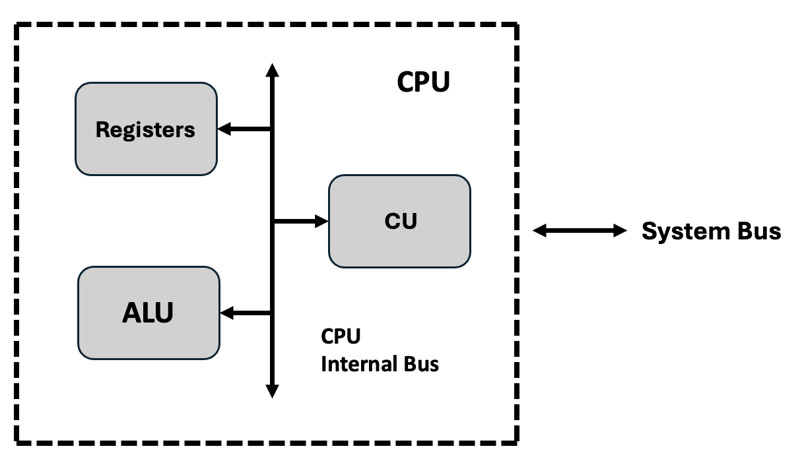
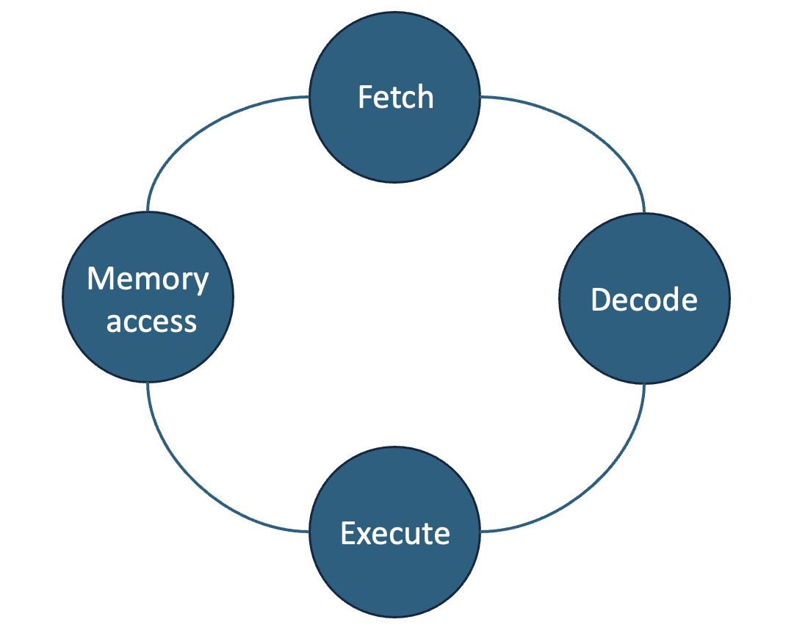
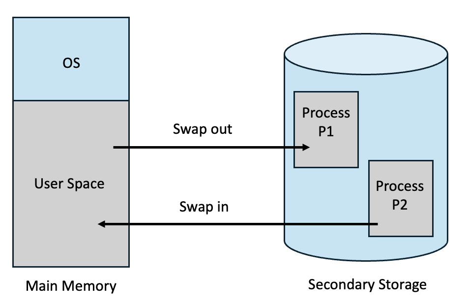

# 네트워크

---

# 네트워크 개요

---

## 네트워크의 정의와 필요성

**네트워크**

- **정의**: 통신 및 데이터 교환을 용이하게 하기 위해 함께 연결된 컴퓨터, 서버, 라우터, 스위치 및 기타 네트워킹 장비와 같은 상호 연결된 장치의 모음

- **네트워크의 필요성**
  - 프린터 등의 공유 자원을 사용하기 위함
  - 이메일, 채팅, 화상 회의 등의 정보 교환을 위함
  - 서버의 데이터에 접근하기 위함

---

## 데이터 통신의 기본 구성 요소

### 송신자(Sender), 수신자(Receiver), 메시지(Message), 전송 매체(Medium), 프로토콜(Protocol)

**송신자(Sender)**

- **정의**: 데이터 메시지를 전송하는 장치
- **특징**: 데이터를 전송하기 위해 적절한 포맷으로 변환함
- **예시**: 이메일 작성자, 서버에서 데이터를 전송하는 애플리케이션

**수신자(Receiver)**

- **정의**: 송신자가 보낸 메시지를 받는 장치
- **특징**: 데이터를 수신하고 이를 적절히 표현하거나 저장함
- **예시**: 이메일 수신자, 서버에서 데이터를 처리하는 애플리케이션

**메시지(Message)**

- **정의**: 송신자가 보내는 실제 데이터
- **특징**: 텍스트, 이미지, 비디오 등 다양한 형태임
- **예시**: 이메일 본문, 데이터 패킷

**전송 매체(Medium)**

- **정의**: 송신자에서 수신자로 이동하는 물리적인 경로
- **특징**: 유선, 무선 또는 혼합 형태로 구현 가능함
- **예시**: LAN 케이블, Wi-Fi

**프로토콜(Protocol)**

- **정의**: 컴퓨터나 원거리 통신 장비 사이에서 메시지를 주고 받는 양식과 규칙의 체계
- **특징**: 데이터의 형식, 순서, 오류 처리 등을 정의함
- **예시**: HTTP/HTTPS, TCP, DHCP


## 네트워크 모델 (Network Models)

### OSI 7계층 모델

- **정의**: 국제표준화기구(ISO)에서 개발한 모델로, 컴퓨터 네트워크 프로토콜 디자인과 통신을 계층으로 7단계로 나누어 설명한 것임
    

**물리 계층 (Physical Layer)**

- **정의**: 장치 간 전기적 신호를 전달하는 계층으로, 데이터 프레임 내부의 각 bit를 한 노드에서 다음 노드로 실제로 이동시키는 계층임
- **특징**: 
  - 통신 데이터의 단위는 Bit
  - 디지털 신호를 전기적인 신호로 변환하여 주고받는 기능 수행함
  - 주요 프로토콜은 RS-232, X.25/X.21
  - 관련 장비로는 케이블(Cable), 리피터(Repeater), 더미허브(Dummy Hub)

**데이터 링크 계층 (Data Link Layer)**

- **정의**: 물리 계층을 통해 송수신되는 정보의 오류와 흐름을 관리하여 안전한 정보의 전달을 수행할 수 있도록 도와주는 역할을 하는 계층임
- **특징**: 
  - 통신 데이터의 단위는 Frame
  - MAC 주소를 이용하여, hop-to-hop 방식으로 물리계층에서 받은 정보를 전달함
  - 주요 프로토콜은 Ethernet, HDLC(High-Level Data-Link Control), PPP(Point-to-Point Protocol)
  - 관련 장비로는 L2 스위치(Switch), 브릿지(Bridge)

**네트워크 계층 (Network Layer)**

- **정의**: 경로를 선택하고 주소를 정하고 경로에 따라 패킷을 전달해주는 역할을 하는 계층임
- **특징**: 
  - 통신 데이터의 단위는 Packet
  - 라우팅, 트래픽 제어, 패킷 정보 전송 등을 수행함
  - 주요 프로토콜은 IP(Internet Protocol), ICMP, RIP
  - 관련 장비로는 라우터(Router), L3 스위치

**전송 계층 (Transport Layer)**

- **정의**: 데이터 전송의 오류 검출, 수정 및 흐름 제어를 수행하는 계층임
- **특징**: 
  - 통신 데이터의 단위는 Segment
  - 오류검출 및 복구, 흐름제어와 중복검사 등을 수행함
  - 주요 프로토콜은 TCP(Transmission Control Protocol), UDP(User Datagram Protocol)
  - 관련 장비로는 게이트웨이(Gateway), L4 스위치

**세션 계층 (Session Layer)**

- **정의**: 응용 프로그램 간의 대화를 유지하기 위한 구조를 제공하고, 이를 처리하기 위해 프로세스들의 논리적인 연결을 담당하는 계층임
- **특징**: 
  - 통신 데이터의 단위는 Message
  - 통신을 하기 위한 세션 확립, 유지, 중단을 수행한다.
  - 주요 프로토콜은 RPC(Remote Procedure Call), NetBIOS

**표현 계층 (Presentation Layer)**

- **정의**: 애플리케이션이 다루는 정보를 통신에 알맞은 형태로 만들거나, 하위 계층에서 온 데이터를 사용자가 이해할 수 있는 형태로 만드는 역할을 담당하는 계층임
- **특징**: 
  - 통신 데이터의 단위는 Message
  - 데이터를 응용, 세션 계층에 보내기 전에 변환함
  - 주요 프로토콜은 SSL(Secure Socket Layer), ASCII(American Standard Code for Information Interchange)

**응용 계층 (Application Layer)**

- **정의**: 응용 프로세스와 직접 관계하여 일반적인 응용 서비스를 수행하는 역할을 담당하는 계층임
- **특징**: 
  - 사용자가 OSI 환경에 접속할 수 있도록 서비스 제공함
  - 응용 프로세스 간의 정보 교환, 파일 전송 등의 서비스를 제공함
  - 주요 프로토콜은 HTTP(HyperText Transfer Protocol), SMTP(Simple Mail Transfer Protocol)

### TCP/IP 모델

- **정의**: 미국 국방성의 DARPA(Defense Advanced Research Projects Agency)에 의해 개발된 모델로, 컴퓨터 네트워크 프로토콜 디자인과 통신을 계층으로 7단계로 나누어 설명한 것임
    

**네트워크 인터페이스 계층 (Network Interface Layer)**

- **정의**: 물리적인 네트워크 매체를 통해 데이터를 전송하는 기능을 담당하는 계층임
- **특징**: 
  - 이더넷, Wi-Fi 등 다양한 LAN 및 WAN 기술을 지원함
  - 하드웨어 주소(MAC 주소)를 사용하여 네트워크 장치를 식별함

**인터넷 계층 (Internet Layer)**

- **정의**: 패킷의 라우팅 및 주소 지정을 담당하고, 서로 다른 네트워크 간의 데이터 전송을 가능하게 하는 계층임
- **특징**: 
  - 데이터를 패킷으로 분할하고, IP 주소를 사용하여 송수신지를 설정함
  - 주요 프로토콜은 IP(Internet Protocol), ICMP(Internet Control Message Protocol)

**전송 계층 (Transport Layer)**

- **정의**: 애플리케이션 간의 통신을 관리하고, 흐름 제어 및 오류 검출 기능을 하는 계층임
- **특징**: 
  - 데이터의 신뢰성 있는 전송 및 흐름 제어, 오류 검사를 담당함
  - 주요 프로토콜은 TCP(Transmission Control Protocol), UDP(User Datagram Protocol)

**응용 계층 (Application Layer)**

- **정의**: 사용자가 직접 상호작용하는 네트워크의 가장 상위 계층임
- **특징**: 
  - 네트워크 기반 응용 프로그램이 작동함
  - 주요 프로토콜은 HTTP(HyperText Transfer Protocol), FTP (File Transfer Protocol)

## 네트워크의 종류 (Types of Networks)


**LAN(Local Area Network)**

- **정의**: 근거리 통신망으로, 지역적인 범위에서 컴퓨터와 기타 장치들이 서로 연결되어 데이터를 공유하는 네트워크임
- **특징**: 
  - 조직내부나 동일 건물등 비교적 좁은 지역을 연결하기 위해 사용함
  - 관리자가 직접 관리하는 방식임
- **장점**: 
  - 내부 네트워크에서 전송 속도가 빠름
  - 내부적으로 네트워크 관리가 가능해 보안 제어가 용이함
- **단점**: 
  - 네트워크 확장이 제한적일 수 있음
  - 한 건물 또는 근거리 내에서만 작동함
- **활용 예시**: 
  - 사내 네트워크에서 파일 공유 및 프린터를 사용함


**WAN(Wide Area Network)**

- **정의**: 근거리 통신망으로, 지역적인 범위에서 컴퓨터와 기타 장치들이 서로 연결되어 데이터를 공유하는 네트워크임
- **특징**: 
  - 일반적으로 공공 통신 인프라를 통해 데이터 전송을 수행한다
  - 수백 킬로미터에서 수천 킬로미터까지의 범위를 커버함
  - 위성, 전화선, 광섬유 등 다양한 전송 매체를 사용하여 연결됨
- **장점**: 
  - 도시, 국가 등의 넓은 범위를 연결함
  - 다양한 네트워크 연결 기술을 지원함
- **단점**: 
  - 설치 및 운영 비용이 상대적으로 높음
  - 속도가 느림
- **활용 예시**: 
  - 인터넷을 통한 이메일 송수신, 원격 사무실 연결

**MAN(Metropolitan Area Network)**

- **정의**: 특정 도시나 대도시 지역 내에서 여러 LAN을 연결하는 네트워크임
- **특징**: 
  - 일반적으로 수십 킬로미터 범위 내에서 운영됨
- **장점**: 
  - 도시 전체나 대규모 지역을 연결할 수 있음
  - 새로운 노드의 추가가 쉬움
  - WAN보다 낮은 비용으로 구축 가능함
- **단점**: 
  - 초기 구축 비용이 상당히 높음
  - 고급 장비에 의존하여, 장비 고장 시 전체 네트워크에 영향을 줌
- **활용 예시**: 
  - 도시 내의 기업 및 기관 간 연결, 대학 캠퍼스 네트워크


**PAN(Personal Area Network)**

- **정의**: 개인의 장치 간에 데이터를 전송하기 위해 사용되는 소규모 네트워크임
- **특징**: 
  - 일반적으로 개인이 소지한 장치 간의 연결을 의미함
  - 10~30m 정도의 짧은 범위를 커버함
- **장점**: 
  - 작은 범위에서 간단히 네트워크를 구성할 수 있음
  - 통신 과정에서 전력 소모가 낮음
- **단점**: 
  - 장치 간 호환성 문제가 발생할 수 있음
  - 동일 주파수 대역에서 작동하는 장치 간 간섭이 발생할 수 있음
- **활용 예시**: 
  - Bluetooth, Wi-Fi Direct, Zigbee


### WLAN(Wireless LAN), SAN(Storage Area Network)

**WLAN(Wireless LAN)**

- **정의**: 유선 연결 대신 무선 기술을 사용하여 로컬 네트워크 노드를 연결하는 근거리 통신망(LAN)의 한 유형
- **특징**: 
  - 무선 주파수(RF) 또는 적외선 기술을 사용하여 데이터를 공중으로 전송하고 수신함
  - 케이블 없이 디바이스를 네트워크에 연결함
  - 액세스 포인트(AP)를 이용하여 신호를 증폭하고 인터넷에 연결함
- **동작 방식**: 
  - 
- **장점**: 
  - 설치, 유지보수, 재배치가 간편함
  - AP를 이용해 쉽게 네트워크를 확장 할 수 있음
  - 어디서든 무선 네트워크를 사용할 수 있음
- **단점**: 
  - 무선 신호의 도청, 신호 스푸핑의 문제가 존재함
  - 유선 LAN보다 느리거나 연결의 안정성이 떨어짐
  - 다수의 사용자가 접속할 경우 네트워크 성능이 낮아짐
- **활용 예시**: Wi-Fi


**SAN(Storage Area Network)**

- **정의**: 여러 컴퓨터와 서버가 공유할 수 있는 고속 전용 스토리지 네트워크
- **특징**: 
  - 일반 네트워크와 분리된 전용 스토리지 네트워크로 동작함
  - 스토리지 디바이스들이 네트워크로 연결되어 중앙화된 논리 볼륨을 형성함
  - 광섬유 채널(Fibre Channel) 등의 기술을 이용하여 고속 데이터 전송을 지원함
- **동작 방식**: 
  - 서버가 스토리지 장치에 데이터 요청을 보냄
  - SAN 스위치가 요청을 전달하고, 스토리지 장치에서 데이터를 검색함
  - 검색된 데이터를 서버로 고속 전송함
- **장점**: 
  - 블록 단위 데이터 전송을 지원하여 빠르고 안정적인 데이터 접근을 제공
  - 데이터 백업, 복구가 쉬움
- **단점**: 
  - 전용 장비와 인프라 구축 비용이 높음
  - 네트워크 설계를 위한 전문 지식이 필요함
  - 파일 공유가 제한됨
- **활용 예시**: 데이터 센터, 클라우드 서비스

## 네트워크 토폴로지 (Network Topology)

### 스타(Star), 버스(Bus), 링(Ring), 메시(Mesh), 트리(Tree)
**스타(Star)**


- **정의**: 가장 흔하게 쓰이는 네트워크 토폴로지로, 네트워크 안의 모든 노드가 동축 케이블이나 연선 또는 광케이블을 통해 직접 하나의 중앙 허브에 연결된 형식
- **특징**: 
  - 중앙 노드는 서버로서 작동하여 데이터의 흐름을 관리함
  - 각각의 노드에서 보낸 정보가 목적지에 닿기 위해서는 반드시 중앙 노드를 지나야 함
  - 중앙 노드는 리피터처럼 데이터 손실을 막아줌

- **장점**: 
  - 한 장소에서 전체 네트워크를 관리할 수 있음
  - 각 노드는 독립적으로 연결되어 있어, 노드 하나의 장애가 발생해도 다른 노드는 운용 가능함
  - 장애가 발생한 경우 원인을 쉽게 찾을 수 있음

- **단점**: 
  - 중앙 허브에 문제가 생기면 전체 네트워크가 모두 멈춤
  - 전체 네트워크의 성능이 중앙 노드에 의해 결정됨

- **활용 예시**: 가정용 네트워크, 소규모 사무실 네트워크


**버스(Bus)**


- **정의**: 네트워크상의 모든 장치가 하나의 케이블로 연결되어 있는 유형
- **특징**: 
  - 네트워크의 한쪽 끝에서 다른 쪽 끝으로 한 방향으로 연결되어 있음
  - 데이터의 흐름이 케이블의 경로를 따라 한 방향으로 이동함

- **장점**: 
  - 구축 비용이 저렴함
  - 장치의 추가, 제거가 쉬움
- **단점**: 
  - 케이블에 장애가 발생할 경우, 모든 네트워크가 중단됨
  - 양 방향 통신이 불가능함
  - 노드를 추가할 때마다, 대역폭이 낭비됨

- **활용 예시**: 이벤트, 전시회 등의 임시 네트워크

**링(Ring)**

- **정의**: 노드들이 원 또는 고리 모양으로 배열되어 있는 유형
- **특징**: 
  - 데이터가 원 모양의 네트워크를 따라 한 방향 또는 양방향으로 흐름
  - 각 노드의 양 옆에는 두 개의 이웃 노드가 존재함

- **장점**: 
  - 한 번에 하나의 노드에서만 데이터를 전송할 수 있어 패킷 충돌의 위험이 낮음
  - 설치 비용이 낮고, 문제 발생 시 원인 파악이 쉬움
- **단점**: 
  - 한 노드에 문제 발생 시 모든 네트워크가 중단됨
  - 노드 추가, 제거 시에 전체 네트워크가 중단됨
- **활용 예시**: 

**메시(Mesh)**


- **정의**: 노드들을 점 대 점으로 상호 연결한 구조로 복잡하고 정교한 유형임
- **특징**: 
  - 모든 노드가 상호연결되어 있음
  - 라우팅 방식으로 전송 시, 최단 거리를 결정하여 데이터를 전송함
  - 플러딩 방식으로 전송 시, 네트워크 내부의 모든 노드에 데이터를 전송함

- **장점**: 
  - 안정성과 보안성이 높음
  - 노드 간에 상호 연결된 정도가 높고 복합적이어서 하나의 노드에 문제가 발생해도, 나머지는 운용 가능함
- **단점**: 
  - 네트워크 관리, 설치, 재구성이 어려움
  - 케이블 등 설치 비용이 많이 듦
- **활용 예시**: 


**트리(Tree)**

- **정의**: 노드들이 부모-자식 계층구조로 연결된 유형임
- **특징**: 
  - 
- **동작 방식**: 
- **장점**: 
  - 네트워크의 확장이 매우 쉬움
  - 성능에 문제가 생긴 경우, 각 노드에 개별적으로 접근할 수 있어 문제 해결이 쉬움
- **단점**: 
  - 상위 계층의 장치에 문제 발생 시, 하위 계층의 장치도 영향을 받을 수 있음
  - 구조가 복잡함
- **활용 예시**: 대규모 기업 네트워크, 캠퍼스 네트워크

# 네트워크 설계와 관리 (Network Design and Management)

#### 네트워크 설계 원칙 (Principles of Network Design) - 확장성(Scalability), 신뢰성(Reliability), 비용 효율성(Cost Efficiency)

**확장성(Scalability)**

- **정의**: 네트워크는 사용자 수나 트래픽 증가에 따라 쉽게 확장 가능해야 함
- **특징**: 
  - 성능 측정을 통해 트래픽 증가에 대응할 방안을 세워야 함
  - 확장성을 높이는 방안
    - 규모 확장
      - 다수의 낮은 사양의 장비에 부하를 분산시킴
    - 용량 확장
      - 성능이 좋은 장비로 교체함

**신뢰성(Reliability)**

- **정의**: 네트워크는 높은 가용성과 장애 발생 시 빠른 복구 능력을 가져야 함
- **특징**: 
  - 결함을 0으로 만드는 것을 불가능하므로, 최대한 줄이는 것이 필요함
  - 신뢰성을 저해하는 요소
    - 하드디스크 고장, 램의 결함 등의 하드웨어 결함
    - 내부 시스템 오류 등의 소프트웨어 결함
    - 관리자의 실수 등의 인적 오류

**비용 효율성(Cost Efficiency)**

- **정의**: 네트워크 설계는 산업 표준과 규정을 준수해야 함
- **특징**: 
  - 높은 성능을 유지하면서도, 비용을 줄이기 위한 기술과 장비를 선택함

#### IP 주소 체계 (IP Addressing System)

- **정의**: 인터넷에 연결되어 있는 각 장치를 식별하기 위해 TCP/IP 프로토콜 모음의 IP계층에서 사용하는 식별자임
- **특징**: 
  - IP 주소를 이용하여 인터넷 또는 로컬 네트워크를 통해 컴퓨터에 정보를 공유함
  - IPv4, IPv6 두 가지의 표준이 있음
##### IPv4 서브넷팅 및 CIDR(Classless Inter-Domain Routing)

**서브넷팅(Subnetting)**

- **정의**: 네트워크를 더 작은 단위의 네트워크로 분할하는 것임
- **특징**: 
  - IP 주소의 일부를 네트워크 주소로 사용하고, 나머지를 호스트 주소로 사용하여 서브넷을 생성함
  - 서브넷 마스크를 사용하여 네트워크와 호스트를 구분함
  - 필요에 따라 서브넷 크기를 조절하여 IP주소를 낭비 없이 사용할 수 있음
- **동작 방식**: 
  - `192.168.1.0/24` 네트워크를 두 개로 서브네팅을 함
  -  서브넷 주소는 각각 `192.168.1.0/25`, `192.168.1.128/25`임
  -  사용 가능한 서브넷 주소는 각각 `192.168.1.1` ~ `192.168.1.126`, `192.168.1.129` ~ `192.168.1.254`임
- **장점**: 
  - IP 주소 낭비를 최소화함
  - 서브넷이 각각 독립적으로 운영되어 네트워크 트래픽을 분산시킬 수 있음
- **단점**: 
  - 계산이 복잡하고, 잘못 설정 시 네트워크가 오히려 비효율적이 됨
  - 서브넷을 너무 많이 나누면 각 서브넷에 할당된 IP 주소의 수가 줄어들어, 전체 성능이 저하됨
- **활용 예시**: 
  - 기업에서 부서 별 서브넷팅을 통해 트래픽 분배

**CIDR(Classless Inter-Domain Routing)**

- **정의**: 인터넷 상의 데이터 라우팅 효율성을 향상시키는 IP 주소 할당 방법으로, 클래스 없는 주소임
- **특징**: 
  -  IP 주소를 보다 효율적으로 배분하고 IP 공간 낭비를 줄이기 위해 도입됨
  -  IP 주소 뒤에 슬래시와 숫자가 붙은 형식으로 표현함. (예: 192.168.1.0/24)
  -  가변 길이 서브넷 마스킹(VLSM)을 사용하여 IP 주소의 네트워크와 호스트 주소 비트 간의 비율을 변경함
- **장점**: 
  - IP 주소의 낭비를 줄일 수 있음
  - 서브넷을 통해 데이터를 빠르게 전송할 수 있음
- **단점**: 
  - 서브넷 마스크를 비트 단위로 설정해야 하므로, 계산이 복잡함
  - 일부 장비는 CIDR을 지원하지 않음
- **활용 예시**: 
  - IP 주소 할당 최적화, 대형 네트워크 설계
##### IPv6 주소 체계와 활용

**IPv6**

- **정의**: IP의 6번째 버전으로, 기존의 IPv4를 대체하는 역할을 함
- **특징**: 
  - `2001:0db8:85a3:0000:0000:8a2e:0370:7334` 와 같은 128비트 또는 16바이트 길이의 주소를 사용함
  - 총 $2^{128}$개의 주소를 제공함
  - 주소는 16진수로 표현되고, 각 블록은 4자리 16진수로 구성됨
  - 연속된 0을 생략할 수 있는 주소 압축이 가능함
- **동작 예시**: 
  - 유니캐스트 주소, 애니캐스트 주소, 멀티캐스트 주소 총 3가지가 사용됨
  - 유니캐스트 주소:
    - 일대일 전송 방식에서 사용함
    - 일반적인 인터넷 통신, 이메일 전송 등에서 사용함
    - `2001:0db8:85a3:0000:0000:8a2e:0370:7334`
  - 애니캐스트 주소:
    - client와 가장 가까운 PC에서 응답하는 방식에서 사용함
    - CDN 서비스에서 사용함
    - 
  - 멀티캐스트 주소:
    - 특정 그룹의 다수 수신자에게 전송할 때 사용함
    - 비디오 스트리밍, 화상 회의 등에서 사용함
    - `ff00::/8` 범위 내의 주소
- **장점**: 
  - IP주소 부족 문제를 해결할 수 있음
  - 자동으로 IP를 구성할 수 있는 기능을 제공함
- **단점**: 
  - IPv4와의 호환이 불가능함
  - IPv6으로의 완전한 전환을 위해 상당한 시간과 비용이 듬
  - 주소 길이가 길어 네트워크 성능이 저하될 수 있음

#### VLAN과 네트워크 분리 (VLAN and Network Segmentation)

**VLAN(Virtual Local Area Network)**

- **정의**: 가상의 랜으로 하나의 물리 스위치에서 여러 가지 네트워크를 사용하도록 하는 기술임
- **특징**: 
  - 한 스위치에서 서로 다른 논리적 네트워크를 구성할 수 있음
  - 다른 VLAN에 속한 장치는 통신을 하지 않음
  - 서로 다른 VLAN에 속한 장치는 통신하지 않기 때문에 보안이 강화된다.
  - 트래픽을 분리하여 혼잡을 줄이고, 네트워크 혼잡을 줄일 수 있다.
  - 스위치에서 설정되고, 스위치가 각 포트에 어떤 VLAN을 할당 할 지 결정한다.
- **동작 방식**: 
- **장점**: 
  - 서로 다른 VLAN에 속한 장치는 통신하지 않기 때문에 보안이 강화됨
  - 트래픽이 분리되어 네트워크 혼잡을 줄임
- **단점**: 
  - VLAN 간 통신을 위해 추가 라우터가 필요함
  - 스위치가 지원해야 구성할 수 있어, 오래된 장비에서는 사용이 어려움
- **활용 예시**: 
  - 학교에서 교사, 학생용 네트워크 분리
  - 공공 네트워크의 고객, 직원용 네트워크 분리


#### NAT(Network Address Translation)와 포트 포워딩 (Port Forwarding)

**NAT(Network Address Translation)**


- **정의**: 하나의 공인 IP 주소를 여러 내부 네트워크 장치가 공유할 수 있도록 해주는 기술임
- **특징**: 
  - 한 스위치에서 서로 다른 논리적 네트워크를 구성할 수 있음
  - 서로 다른 VLAN에 속한 장치는 통신하지 않기 때문에 보안이 강화됨
  - 트래픽을 분리하여 혼잡을 줄이고, 네트워크 혼잡을 줄일 수 있음
  - 스위치에서 설정되고, 스위치가 각 포트에 어떤 VLAN을 할당 할 지 결정함
- **동작 방식**: 
  - 송신자는 패킷 헤더에 출발지와 목적지의 IP주소를 기록함(출발지는 사설IP 주소)
  - 패킷이 게이트웨이를 지나면 출발지의 IP주소를 자신의 공인 IP주소로 변경하고, NAT 테이블에 변경 내역을 저장함
  - 서버에서 패킷 수신 시, NAT 테이블에 저장된 IP주소를 확인하여 각 Host에게 패킷을 전달함
- **장점**: 
  - 다수의 장치가 하나의 공인 IP 주소를 사용하므로, IPv4의 주소를 절약할 수 있음
  - 내부 IP가 외부에 알려지지 않아 보안성이 향상됨
  - 내부 네트워크 확장이 자유로움
- **단점**: 
  - NAT 변환 작업으로 인한 처리 속도가 저하됨
  - 일부 애플리케이션은 NAT 환경에서 작동하지 않을 수 있음
  - IPv6에서는 사용되지 않음
- **활용 예시**: 
  - 가정용 공유기에서 여러 장치 사용

**포트 포워딩 (Port Forwarding)**

- **정의**: 외부 네트워크에서 특정 포트로 들어오는 요청을 내부 네트워크의 특정 장치로 연결하는 방식임
- **특징**: 
  - 외부에서 들어오는 특정 포트를 지정함
  - 수동으로 포워딩 규칙을 설정해야 함
- **동작 방식**: 
  1. 외부 사용자가 공인 IP와 특정 포트로 요청.
  2. NAT는 요청을 미리 설정된 내부 네트워크 장치와 포트로 전달
  3. 내부 장치에서 응답 시 NAT가 외부 사용자로 응답 반환
- **장점**: 
  - 외부에서 내부 서비스에 접근 가능함
  - 고정된 IP가 필요하지 않음
- **단점**: 
  - 특정 포트가 외부에 개방되여 보안 문제가 발생할 수 있음
  - 포트를 개방하면, 많은 양의 트래픽이 내부로 전달되므로 성능이 저하됨
- **활용 예시**: 
  - 원격으로 다른 PC에 접속함
  - IoT 기기를 가정용 네트워크에 연결함


#### 트래픽 관리와 QoS (Traffic Management and Quality of Service)

**트래픽 관리**

- **정의**: 네트워크 장치에서 트래픽의 흐름을 모니터링하고 제어하여 병목 현상을 방지하는 것임
- **특징**: 
  - 실시간 서비스와 비실시간 서비스의 차이를 맞추고 트래픽이 원활히 전달되도록 우선순위를 보장함
  - 네트워크 성능에 영향을 미치는 주요 요소:
    - 대기 시간 (Latency):
      - 패킷이 네트워크를 통해 전달되는 데 걸리는 시간임
    - 지연 변동 (Jitter):
      - 패킷이 네트워크를 통해 전달될 때의 지연 시간의 변동임
    - 패킷 손실 (Packet Loss):
      - 네트워크에서 패킷이 손실되는 현상임
    - 대역폭 (Bandwidth):
      - 네트워크가 데이터를 전송할 수 있는 속도임

- **동작 방식**: 
  - 트래픽 쉐이핑(Traffic Shaping): 네트워크 트래픽 속도를 제한하여 과도한 사용을 방지함
  - 로드 밸런싱(Load Balancing): 트래픽을 여러 서버로 분산하여 네트워크 부하를 줄임
  - 대역폭 할당(Bandwidth Allocation): 사용자 또는 애플리케이션별로 대역폭을 고정 또는 가변적으로 설정함
- **장점**: 
  - 대역폭을 적절히 할당하여 네트워크 혼잡을 줄임
  - QoS를 보장함
  - 비정상적인 트래픽을 감지하여 보안성을 높임
- **단점**: 
  - 대규모 트래픽 관리에 높은 비용이 듦
  - 트래픽 정책, 우선순위 등 설정이 복잡하고 성능이 저하될 수 있음
- **활용 예시**: 기업 네트워크에서 직원들이 스트리밍 서비스를 사용하는 것을 제한하고, 업무 관련 트래픽에 더 많은 대역폭을 할당함

**QoS (Traffic Management and Quality of Service)**

- **정의**: 네트워크 트래픽 중 중요 데이터를 우선적으로 처리하여 서비스 품질을 보장하는 기술임
- **특징**: 
  - 트래픽 유형 별로 대역폭을 할당함
  - 우선 순위에 따라 처리 순서를 결정함
- **동작 방식**: 
  - 네트워크 장비가 트래픽을 분석하고, 패킷 헤더에 QoS 정보를 삽입함
  - 우선순위를 설정하거나, 대역폭을 제한함
- **장점**: 
  - 스트리밍 등 실시간 애플리케이션의 성능과 안정성을 보장함
  - 중요 트래픽을 우선 처리하여 효율성을 높임
- **단점**:
  - QoS 설정에 대한 높은 지식이 필요함
  - 대역폭이 부족한 경우 QoS로 해결이 불가능함
  - 모든 장치가 QoS를 지원해야 효과적임 
- **활용 예시**: 회사에서 VoIP 통화와 비디오 컨퍼런스 트래픽은 가장 높은 우선순위를 부여하며, 일반 인터넷 브라우징 트래픽은 낮은 우선순위를 부여함


# 네트워크 성능 평가 및 최적화 (Network Performance Evaluation and Optimization)

## 네트워크 성능 지표 (Network Performance Metrics)

**대역폭(Bandwidth)**

- **정의**: 단위 시간 동안 통신 매체를 통해 송수신할 수 있는 최대 정보량
- **특징**: 
  - 주로 초당 비트수(bps) 단위로 측정함
  - 대역폭이 크면 전송 속도가 빨라짐

**지연(Latency)**

- **정의**: 데이터가 송신자에서 수신자까지 도달하는 데 걸리는 시간
- **특징**: 
  - 네트워크의 응답 시간을 측정하는 지표임
  - 낮을 수록 네트워크의 성능이 좋음


**처리량(Throughput)**

- **정의**: 단위 시간당 네트워크를 통해 실제로 전송되는 정보량
- **특징**: 
  - 네트워크를 통해 얼마나 많은 양의 데이터가 전송될 수 있는 지 나타냄
  - 
- **동작 방식**: 

## 네트워크 트래픽 분석 (Traffic Analysis)

- **정의**: 네트워크에서 발생하는 데이터를 모니터링하고 분석하여 성능 문제를 해결하고, 최적화 방안을 찾는 과정임
- **특징**: 
  - 성능을 모니터링하고, 최적화 하는 것이 목적임
  - 주로 흐름 데이터, 패킷 데이터를 가지고 정보를 수집함
  - 트래픽 분석 도구
    - Wireshark: 네트워크 트래픽을 실시간으로 캡처하고 분석할 수 있는 도구
    - SolarWinds: 네트워크 성능 모니터링 및 트래픽 분석 도구
    - NetFlow Analyzer: 네트워크 트래픽 패턴을 분석하여 성능 최적화 및 용량 계획에 활용되는 도구
- **활용 예시**: 
  - 트래픽 급증 분석, DDoS 공격 대응

## 부하 분산과 로드 밸런싱 (Load Balancing)

- **정의**: 애플리케이션을 지원하는 리소스 풀 전체에 네트워크 트래픽을 균등하게 배포하는 방법
- **특징**: 

    
  - 애플리케이션 서버와 방문자 또는 클라이언트 간의 인터넷 트래픽을 지시하고 제어함
  - 오토 스케일링을 하여 조건에 맞추어 서버 용량을 변경함
  - L4와 L7에서의 정보를 바탕으로 각각 수행됨
- **동작 방식**: 
  - 로드 밸런싱 알고리즘
    - 라운드 로빈(Round Robin)
      - 정적 로드 밸런싱 방법으로, 여러 서버에게 균등하게 분산하는 알고리즘
      - 서버 별로 요청을 균등하게 처리할 수 있음
      - 구현이 간단하고 효율적이지만, 특정 대상이 부하를 많이 받는 문제 발생할 수 있음
    - 최소 연결 방법
      - 동적 로드 밸런싱 방법으로, 현재 연결된 수가 가장 적은 서버에 우선적으로 요청하는 알고리즘
      - 대상의 부하 상태나 성능을 고려하지 않고, 연결 수가 적은 서버에 많은 요청을 보냄
      - 서버의 성능이나 상태를 고려하지 않으므로, 불균형한 로드 밸런싱이 발생함
- **장점**: 
  - 여러 서버 간의 네트워크 트래픽을 지능적으로 처리 가능함
  - 트래픽을 모니터링하여 DDoS 공격 등을 방어함
  - 서버 간에 로드를 균등하게 배포하여 애플리케이션의 성능을 향상함
- **단점**: 
  - 초기 시스템 구축 시 하드웨어 및 소프트웨어의 비용이 발생함
  - 환경에 따른 알고리즘 도입 등의 구성이 복잡함
- **활용 예시**: 
  - AWS의 ALB, NLB

## 중앙처리장치 (CPU)
- 역할:
   - 컴퓨터 시스템의 두뇌 역할을 하며, 명령어를 해석하고 실행
   - 산술 연산, 논리 연산, 데이터 이동, 제어 신호 생성 등을 담당 
### CPU의 구조와 구성 요소

#### 1. 연산 장치 (ALU: Arithmetic Logic Unit):
- 산술 연산과 논리 연산 등을 수행
- 입력된 데이터에 대해 연산을 수행하고, 그 결과를 레지스터로 전달하거나 메모리에 저장
- 가산기, 보수기, 누산기 , 데이터 레지스터 등으로 구성


#### 2. 제어 장치 (CU: Control Unit):
- 프로그램 명령을 해석하고 실행 순서를 제어
- 기억 장치로부터 명령을 순차적으로 꺼내 해독하고, 해석에 따라 명령어 실행에 필요한 제어 신호를 기억 장치, 연산 장치, 입출력 장치 등으로 보내는 장치 
- 프로그램 카운터(PC), 명령 해독기, 부호기, 명령 레지스터 등으로 구성


#### 3. 레지스터 (Register):
- CPU 내에 있는 소규모 고속 기억장치
- 명령어 주소, 코드, 연산에 필요한 데이터, 연산 결과 등을 임시로 저장
- 종류:
  - 범용 레지스터: 데이터 저장
  - 특수 레지스터: 프로그램 카운터(PC), 명령어 레지스터(IR), 스택 포인터(SP) 등
#### . 내부 버스 (CPU Internal Bus):
- ALU, 레지스터 간 데이터 이동을 위한 데이터 선들과 주소 선들, 그리고 제어 유닛으로부터 발생되는 제어 신호들을 전송하는 선들로 구성
- 외부 시스템 버스와 직접적으로 연결되지는 않음
  
### 명령어 사이클 (Instruction Cycle)
- 정의: CPU가 하나의 명령어를 처리하는 과정을 의미 
#### 명령어 사이클 단계


1. Fetch
   - 목적: 메모리에서 실행할 명령어를 가져옴
   - 동작:
     - PC에 저장된 즈소를 통해 메모리에서 명령어를 읽어옴
     - 읽은 명령어는 IR(명령 레지스터)에 저장
     - PC는 그 다음 명령어의 주소를 가리키도록 증가
2. Decode
   - 목적: 가져온 명령어를 해석하여 어떤 작업을 해야 할지 결정
   - 동작:
     - CU가 명령어를 분석
     - 명령어가 산술 연산, 논리 연산, 데이터 이동 등 무엇을 해야 하는지 해석됨
     - 필요한 연산에 따라 ALU, 레지스터, 메모리 등을 결정
3. Execute
   - 목적: 명령어에 정의된 작업을 실행
   - 동작:
     - ALU가 산술 연산을 수행하거나, 논리 연산을 처리
     - 연산 결과는 레지스터나 메모리에 저장
4. Memory Access
   - 목적: 메모리에서 데이터를 읽거나 데이터를 메모리에 저장
   - 동작:
     - 읽기 또는 쓰기 작업이 필요한 경우, 메모리에 접근

### 메모리 접근 방식 (Memory Access Methods)
#### 1. 캐시 메모리 접근 방식
- 정의: CPU는 먼저 캐시 메모리에서 데이터를 찾고, 없으면 주 메모리에 접근
- 장점: 데이터 접근 속도 향상 
- 단점: 캐시 미스가 발생하면 성능 저하
  
#### 2. DMA (Direct Memory Access)
- 정의: CPU 개입 없이 메모리와 주변 장치 간 데이터 전송이 이루어지는 방법
- 특징:
  - CPU 개입 없이 주변 장치와 주기억장치와의 데이터 직접 전송
  - CPU는 DMA와 상태정보 및 제어정보만을 주고 받음 
- 장점: CPU의 부담을 줄이고 병렬 처리 가능 
- 단점: DMA 컨트롤러와의 추가적인 하드웨어 요구


## 메모리 구조
### 메모리 계층 구조 (Memory Hierarchy)
- 정의: 메모리 장치들이 성능과 비용을 기준으로 계층적으로 구성된 구조


#### 구성 요소 
#### 1. 레지스터 (Registers)
- 위치: CPU 내에 위치
- 속도: 가장 빠름
- 용량: 매우 작음
- 특징: 직접 데이터를 처리하는 가장 작은 저장 공간
- 용도: 임시 데이터, 연산 중간 겨과, PC 등의 저장

#### 2. 캐시 메모리 (Cache Memory)
- 위치: CPU와 주 메모리(RAM) 사이에 위치
- 속도: 매우 빠르지만 레지스터보다는 느림
- 용량: 작은 크기 (보통 킬로바이트에서 몇 메가바이트)
- 특징: 
  - 자주 사용하는 데이터나 명령어를 저장하여 CPU가 빠르게 접근할 수 있게 하는 고속 메모리
- 용도: 자주 사용되는 데이터나 명령어를 빠르게 공급하여 성능 향상
 
#### 3. 주 메모리 (Primary Memory / RAM)
- 위치: CPU와 보조 저장 장치(HDD,SSD) 사이에 위치
- 속도: 캐시보다는 느리지만 상대적으로 빠름
- 용량: 수 기가바이트
- 특징: 프로그램 실행 중 필요한 데이터와 명령어를 저장하는 휘발성 메모리
- 용도: 운영 체제, 실행 중인 프로그램, 시스템의 데이터 저장

#### 4. 보조 저장 장치 (Secondary Storage)
- 위치: CPU와 주 메모리보다 아래 단계에 위치
- 속도: 매우 느림
- 특징: 비휘발성 메모리로 데이터를 영구적으로 저장
- 용도: 장기적인 데이터 저장, 운영 체제

#### 5. 원격 보조 저장 장치 (Remote Secondary Storage)
- 위치: 보조 저장 장치보다 더 아래에 위치
- 속도: 가장 느림
- 용량: 대규모 저장 용량을 제공
- 특징: 장기적인 백업 및 아카이빙을 위한 저장 장치 
- 용도: 백업, 대규모 데이터 저장

### 캐시 메모리 
- 정의: CPU와 주 메모리 사이에 위치하는 고속의 작은 용량의 메모리
- 역할 
  - 속도 차이 해결: CPU와 주 메모리 간의 속도 차이를 줄여줌ㅈ
  - 자주 사용되는 데이터 저장: CPU가 자주 사용하는 데이터를 저장하며, 해당 데이터를 반복적으로 빠르게 접근할 수 있게 함
#### 캐시 적중률 (Cache Hit Rate)


- 정의: 캐시 메모리에서 데이터가 성공적으로 조회된 비율을 나타내는 성능 지표
#### 캐시 적중 (Cache Hit)
- CPU가 요청한 데이터가 캐시 메모리에 이미 존재하는 경우.
- 캐시에서 데이터를 빠르게 읽을 수 있어 빠른 처리가 가능

#### 캐시 미스율 (Cache Miss Rate)


- 정의: 캐시에서 데이터를 찾지 못하고 메인 메모리로 접근해야 하는 비율을 나타냄 
#### 캐시 미스 (Cache Miss)
- 캐시에서 CPU가 요청한 데이터가 존재하지 않을 때 발생하는 상황
- CPU는 주 메모리에서 데이터를 가져와야 하므로 시간이 더 소요됨

### 가상 메모리 (Virtual Memory)
- 정의: 컴퓨터 시스템에서 물리적 메모리보다 더 많은 메모리 공간을 사용할 수 있도록 하는 기술
#### 1. 가상 주소 공간 (Virtual Address Space)
- 각 프로세스는 독립적인 가상 주소 공간을 가지며, 이를 통해 자신의 주소 공간을 마치 연속적인 메모리처럼 사용할 수 있음
#### 2. 페이지와 페이지 테이블
- 가상 메모리 시스템은 페이지 단위로 메모리를 관리
- 가상 주소는 페이지라는 작은 단위로 나뉘어 있으며, 각 페이지는 물리 메모리의 프레임에 매핑 
- 페이지 테이블은 가상 주소와 물리 주소를 매핑하는 데 사용되는 자료구조
#### SWAP


- 물리 메모리가 부족할 때 일부 데이터를 디스크로 옮겨서 가상 메모리 공간을 확보하는 과정
- 스왑 공간: 디스크의 일부를 가상 메모리 시스템에서 임시 저장소로 사용하는 영역
- 스왑 아웃(Swap Out): 물리 메모리에서 사용되지 않는 데이터를 스왑 공간으로 이동시키는 작업
- 스왑 인(Swap In): 스왑 공간에 저장된 데이터를 다시 물리 메모리로 가져오는 작업
- 동작 과정:
  1. 물리 메모리가 부족하면 메모리 확보하기 위해 페이지 교체를 실행
  2. 선택된 페이지는 스왑 공간으로 이동하고, 물리 메모리에서 해당 공간을 해제
  3. 스왑 공간에 저장된 페이지가 필요해지면 디스크에서 메모리로 로드 
### TLB (Translation Lookaside Buffer)


- 정의: 가상 메모리 시스템에서 가상 주소를 물리 주소로 빠르게 변환하기 위해 사용되는 하드웨어 캐시
- 동작 방식
  1. 가상 주소 생성: 이 가상 주소는 가상 메모리 시스템 내에서만 유효
  2. 가상 주소가 TLB에 존재한다면, TLB에서 직접 물리 주소를 얻을 수 있음
  3. 가상 주소가 TLB에 존재하지 않는다면, CPU는 페이지 테이블을 조회하여 물리 주소를 찾아야 함 
  4. 가상 주소는 TLB나 페이지 테이블을 통해 물리 주소로 변환되고 물리 주소를 통해 데이터를 가져옴
- 장점: 메모리 접근 시간 단축
- 단점: 하드웨어 캐시이므로 용량이 제한적


## 입출력 시스템
- 정의: 컴퓨터 시스템 외부와 데이터를 교환하는 장치로, 사용자와 컴퓨터 간에 정보를 전달. 
### 입출력 장치와 동작 원리
- 입력 장치: 데이터를 컴퓨터로 전달.
- 출력 장치: 데이터를 사용자나 다른 시스템으로 전달.
#### 동작 원리
1. 제어
   - 명령어를 통해 입출력 장치에 작업을 지시.
2. 상태 확인
   - 장치가 준비 상태인지 확인하여 작업의 실행 가능 여부를 결정.
3. 데이터 전송
   - 데이터는 CPU와 장치 간 또는 메모리와 장치 간에 이동.
### 입출력 제어 방식
#### 1. 폴링 방식
- 동작 원리:
  - CPU가 주기적으로 장치의 상태를 확인하여 작업 가능 여부를 결정.
- 특징:
  - CPU가 장치 상태를 지속적으로 확인하므로 효율성이 낮고, CPU 자원 낭비가 큼.
- 예: 키보드 입력 확인.
#### 2. 인터럽트 방식
- 동작 원리:
  - 입출력 장치가 준비되면 인터럽트 신호를 CPU로 전송하여 작업 요청.
  - CPU는 작업을 중단하고 인터럽트를 처리한 뒤, 원래 작업으로 복귀.
- 특징:
  - CPU는 다른 작업을 수행할 수 있어 효율성이 높음.
  - 과도한 인터럽트 발생 시 처리 오버헤드 발생.
- 예: 네트워크 데이터 수신.
#### 3. DMA
- 동작 원리:
  - CPU 개입 없이, DMA 컨트롤러가 메모리와 입출력 장치 간의 데이터 전송을 처리.
  - CPU는 데이터 전송을 지시한 후 다른 작업을 수행하며, DMA 완료 후에만 상태 확인. 
- 특징:
  - 대량의 데이터를 빠르게 전송 가능.
  - CPU 자원 활용이 효율적.
- 예: 디스크 I/O.
### 인터럽트 (Interrupt)
- 정의: 특정 이벤트가 발생했음을 CPU에 알리고, 현재 작업을 잠시 중단하여 그 이벤트를 처리하는 메커니즘.
- 동작 원리:
  1. 이벤트 발생
  2. 작업 중단
  3. 인터럽트 처리
  4. 복귀
- 장점: 
  - CPU 효율성 향상.
  - 다양한 작업을 동시에 처리 가능.
- 단점:
  - 설계가 복잡.
  - 우선순위 관리가 필요.
### 입출력 버스와 데이터 전송
#### 입출력 버스
- 정의: CPU와 입출력 장치 간의 데이터를 전달하는 통로.
- 구성 요소
  1. 데이터 버스
     - 데이터 실제 전달 통로.
  2. 주소 버스
     - 데이터가 전송될 목적지를 지정.
     - CPU가 메모리나 장치를 식별하는 데 사용.
  3. 제어 버스
     - 데이터 전송의 타이밍과 상태를 제어.
#### 데이터 전송 방식
1. 프로그램 제어 방식
   - CPU가 모든 데이터를 직접 전송.
2. 인터럽트 방식
3. DMA
## 프로세서 설계
### 데이터 경로 설계 (Datapath Design)
- 정의: 프로세서 내부에서 데이터가 이동하는 경로 설계.
#### 1. 단일 사이클 데이터 경로 (Single-Cycle Datapath)
- 각 명령어를 하나의 클럭 사이클 내에 처리.
- 모든 연산이 동시에 완료되어야 함.
- 장점: 설계가 단순.
- 단점: 클럭 주기가 가장 느린 명령어에 맞춰져야 하므로 비효율적.
#### 2. 다중 사이클 데이터 경로 (Multi-Cycle Datapath)
- 명령어를 여러 클럭 사이클에 걸쳐 처리.
- 각 클럭 사이클에서 데이터 이동과 연산의 일부만 수행.
- 장점: 클럭 주기가 최적화됨.
- 단점: 제어 복잡.
### 제어 유닛 설계 (Control Unit Design)
- ISA(명령어 집합 구조)를 기반으로 함.
#### 1. 하드와이어드 제어 (Hardwired Control)
- 제어 신호가 논리 게이트와 플립플롭 같은 하드웨어 회로로 구현.
- 특징:
  - 설계 복잡하지만 속도가 빠름.
  - 명령어 집합 변경 시 회로 재설계 필요.
#### 2. 마이크로프로그래밍 제어 (Microprogrammed Control)
- 제어 신호가 마이크로명령어로 저장된 메모리에서 읽혀 실행.
- 특징:
  - 속도가 다소 느림.
  - 설계가 유연하고 명령어 확장이 쉬움.

### 파이프라인 처리 (Pipeline Processing)
- 정의: CPU에서 명령어 처리 단계를 병렬화하여 처리 속도를 높이는 기술. 
#### 처리 단계
1. IF (Instruction Fetch): 명령어를 메모리에서 가져옴.
2. ID (Instruction Decode): 명령어 해독.
3. EX (Execute): 연산 수행.
4. MEM (Memory Access): 메모리 접근(Read/Write).
5. WB (Write Back): 결과를 레지스터에 기록.
- 장점:
  - 병렬 처리로 CPU 성능 향상.
  - 단위 시간당 더 많은 명령어 실행 가능.
- 단점:
  - 파이프라인 해저드 발생 가능.
  - 각 단계 간의 데이터 흐름과 제어 복잡.
#### 파이프라인 해저드 (Pipeline Hazards)
1. 구조적 해저드 (Structural Hazard)
   - 동일한 자원을 여러 명령어가 동시에 사용하려고 할 때 발생.
   - 예: 메모리나 레지스터 파일의 동시 접근.
   - 해결 방법: 자원을 복제하거나 병렬 처리 가능하도록 설계.
2. 데이터 해저드 (Data Hazard)
   - 명령어 간 데이터 의존성 때문에 발생.
   - 예: 이전 명령어의 결과가 다음 명령어에서 필요하지만 아직 준비되지 않은 경우.
   - 해결 방법:
      - 포워딩(Forwarding): 결과를 즉시 다음 단계로 전달.
      - 버블 삽입(Stalling): 대기 상태를 삽입하여 데이터 준비 시간을 확보.
3. 제어 해저드 (Control Hazard)
   - 분기 명령어나 조건문 실행으로 인해 발생.
   - 예: 분기 결과가 확정되기 전에 파이프라인이 잘못된 명령어를 가져올 때.
   - 해결 방법:
      - 분기 예측(Branch Prediction): 분기 결과를 예측하여 명령어 실행.
## 성능 평가와 최적화 
### 성능 측정 자료
### Amdahl의 법칙 (Amdahl's Law)
- 정의: 병렬 처리를 통해 성능을 개선할 때, 병렬화 가능한 비율과 병렬 처리에 참여하는 프로세서의 수가 성능 향상에 어떤 영향을 미치는지 분석하는 법칙.
- 공식
  - S: 성능 향상 비율.
  - P: 병렬화 가능한 작업 비율.
  - N: 병렬 처리에 참여하는 프로세서의 수.
  - (1-P): 병렬화가 불가능한 작업 비울.
----공식 이미지 넣기 
### 시스템 성능 최적화 
#### 1. 캐시 최적화 (Cache Optimization)
- 목표: 캐시 히트율을 최대화하는 것.
#### 캐시 최적화 기법
#### 1.1 배치 처리 (Batch Processing)
- 정의: 데이터를 일괄적으로 처리하여 캐시 접근을 최적화하는 기법.
#### 1.2 반복문 최적화 (Loop Optimization)
- 정의: 반복문을 최적화하여 캐시 효율을 극대화하는 기법.
- 내부 루프 최적화: 내부 루프에서 연속된 메모리 영역을 접근하도록 배열 최적화.
- 루프 분할: 반복문을 작은 블록으로 나누어 각 블록을 처리.
- 예시
```c
int main() {
    int n = 1000;
    int result = 0;
    
    // 비효율적인 예시: 중복 계산
    for (int i = 0; i < n; i++) {
        result += i * 2;  // 'i * 2'가 반복적으로 계산됨
    }

    // 최적화된 예시: 중복 계산 제거
    int multiplier = 2;
    for (int i = 0; i < n; i++) {
        result += i * multiplier;  // 'i * 2' 대신 multiplier 사용
    }

    printf("Result: %d\n", result);
    return 0;
}
```
#### 1.3 프리페칭 (Prefetching)
- 정의: CPU가 데이터를 미리 캐시로 로드하여 캐시 미스를 줄이는 기법.

#### 2. 멀티스레딩 및 병렬 처리
- 정의: 여러 작업을 동시에 실행하여 성능을 최적화함.
- 멀티스레딩 (Multithreading)
  - 하나의 프로세스 내에서 여러 스레드를 사용하여 작업을 동시에 처리하는 기술.
- 병렬 처리 (Parallel Processing)
  - 여러 프로세서나 코어를 사용하여 하나의 작업을 분할하여 동시에 처리하는 방식.


## 입출력 시스템 (I/O Systems)

### 입출력 장치와 동작 원리 (I/O Devices and Operations)

- **정의**
    - 입출력 장치는 컴퓨터와 외부 장치 간에 데이터를 주고받는 하드웨어 장치임
    - 동작 원리는 데이터를 변환하여 컴퓨터가 이해할 수 있는 형식으로 입출력을 수행함
- **특징**
    - **입력 장치**: 키보드, 마우스, 센서 등 외부 데이터를 컴퓨터로 입력
    - **출력 장치**: 모니터, 프린터, 스피커 등 외부로 데이터를 출력
- **동작 방식**
    - 입력 장치는 사용자가 제공하는 데이터를 신호로 변환하여 컴퓨터로 전송
    - 출력 장치는 컴퓨터에서 처리한 데이터를 외부 장치가 이해할 수 있는 형태로 변환하여 전달
- **장단점**
    - **장점**: 컴퓨터와 사용자 간의 상호작용을 가능하게 하고, 외부 장치와의 데이터 통신을 지원함
    - **단점**: I/O 장치가 많은 경우, 컴퓨터의 처리 속도가 저하될 수 있음
- **활용**
    - 다양한 센서나 입력 장치를 통해 데이터를 수집하고, 화면에 표시하거나 다른 장치로 결과를 출력하는 시스템에서 활용됨

### 입출력 제어 방식 (I/O Control Mechanisms)

**프로그램 제어(Programmed I/O)**

- **정의**
    - CPU가 I/O 장치를 직접 제어하는 방식으로, CPU가 각 입출력 작업을 순차적으로 처리함
- **특징**
    - **동기적 처리**: CPU가 I/O 작업을 끝낼 때까지 기다리며, 다른 작업은 수행하지 않음
    - CPU가 직접 제어하므로 I/O 장치에 대한 관리가 간단함
- **동작 방식**
    - CPU는 I/O 명령을 실행하여 장치와 데이터를 주고받음
    - 입출력 작업이 끝날 때까지 CPU가 대기함
- **장단점**
    - **장점**
        - 구현이 간단하고, CPU와 장치 간의 상호작용이 직관적임
    - **단점**
        - I/O 작업을 기다리는 동안 CPU가 다른 작업을 수행할 수 없음, CPU 효율이 떨어짐
- **활용**
    - 간단한 I/O 작업이나 소형 장치에서 사용됨
- **코드 예시**
    - **C**
        
        ```c
        void programmed_io() {
            // 데이터 읽기
            input_data = read_input_device();
            // 데이터 처리
            process_data(input_data);
            // 데이터 출력
            write_output_device(output_data);
        }
        ```
        
        - **이유**
            - CPU가 I/O 작업을 순차적으로 처리하는 구조를 보여주기 위함
    - **Python**
        
        ```python
        def programmed_io():
            input_data = read_input_device()  # 입력 장치에서 데이터 읽기
            output_data = process_data(input_data)  # 데이터 처리
            write_output_device(output_data)  # 출력 장치로 데이터 전송
        ```
        
        - **이유**
            - 프로그램 제어 방식의 입출력 처리를 간단히 나타내기 위함

**인터럽트 방식(Interrupt-driven I/O)**

- **정의**
    - 입출력 작업을 요청한 후, CPU가 다른 작업을 수행하다가 I/O 장치가 작업을 완료하면 인터럽트를 통해 CPU에게 알림
- **특징**
    - CPU는 I/O 작업 완료를 기다리지 않고 다른 작업을 수행할 수 있음
    - I/O 장치에서 작업을 완료했을 때만 CPU가 개입함
- **동작 방식**
    - I/O 작업 요청 후, CPU는 다른 작업을 처리
    - I/O 장치가 작업을 마친 후 인터럽트를 발생시키면, CPU가 해당 작업을 처리함
- **장단점**
    - **장점**
        - CPU가 유휴 상태 없이 다른 작업을 할 수 있어 효율적임
    - **단점**
        - 인터럽트 처리로 인해 복잡성이 증가하고, 자원의 관리가 필요함
- **활용**
    - 실시간 처리나 높은 효율성을 요구하는 시스템에서 사용됨
- **코드 예시**
    - **C**
        
        ```c
        void interrupt_io() {
            // I/O 요청
            request_io_device();
            // 다른 작업 수행
            perform_other_tasks();
            // I/O 완료 인터럽트 처리
            if (interrupt_received) {
                handle_io_interrupt();
            }
        }
        ```
        
        - **이유**
            - 인터럽트 방식에서 CPU가 I/O 작업을 대기하지 않고 다른 작업을 처리하는 구조를 나타내기 위함
    - **Python**
        
        ```python
        def interrupt_io():
            request_io_device()  # I/O 장치 요청
            perform_other_tasks()  # 다른 작업 수행
            if interrupt_received:  # 인터럽트 발생 시
                handle_io_interrupt()  # 인터럽트 처리
        ```
        
        - **이유**
            - 인터럽트 방식에서 CPU가 대기하지 않고 다른 작업을 수행하는 구조를 보여주기 위함

**DMA(Direct Memory Access)**

- **정의**
    - CPU의 개입 없이 I/O 장치가 직접 메모리와 데이터를 주고받는 방식
- **특징**
    - CPU와 I/O 장치가 메모리 버스를 공유하며, CPU는 데이터 전송을 중개하지 않음
    - 고속 데이터 전송이 가능함
- **동작 방식**
    - DMA 컨트롤러가 I/O 장치와 메모리 간의 데이터 전송을 관리
    - CPU는 DMA 작업이 완료될 때까지 대기하거나 다른 작업을 수행할 수 있음
- **장단점**
    - **장점**
        - CPU 부담을 줄이고, 고속 데이터 전송이 가능함
    - **단점**
        - DMA 관리에 필요한 추가 하드웨어가 필요함
- **활용**
    - 대량의 데이터 전송이 필요한 시스템, 예를 들어 대용량 파일 처리나 네트워크 데이터 전송에서 활용됨
- **코드 예시**
    - **C**
        
        ```c
        void dma_transfer() {
            // DMA 요청
            initiate_dma_transfer();
            // DMA 작업 수행 (CPU 개입 X)
            wait_for_dma_completion();
            // 데이터 처리
            process_data();
        }
        ```
        
        - **이유**
            - DMA 방식에서 CPU 개입 없이 데이터 전송이 이루어지는 구조를 나타내기 위함
    - **Python**
        
        ```python
        def dma_transfer():
            initiate_dma_transfer()  # DMA 요청
            wait_for_dma_completion()  # DMA 작업 수행 (CPU 개입 X)
            process_data()  # 데이터 처리
        ```
        
        - **이유**
            - DMA 방식에서 CPU 개입 없이 데이터를 전송하는 구조를 보여주기 위함

### 인터럽트 (Interrupts)

- **정의**
    - CPU의 작업을 잠시 멈추고 다른 중요한 작업을 수행하는 시스템 방식으로, I/O 장치나 타이머 등에서 발생함
- **특징**
    - 인터럽트는 외부 장치가 발생시켜 CPU에게 즉시 처리가 필요한 작업이 있음을 알리는 신호임
    - 하드웨어나 소프트웨어에 의해 발생할 수 있음
- **동작 방식**
    - 인터럽트 발생 시, 현재 실행 중인 작업을 잠시 멈추고 인터럽트 서비스 루틴(ISR)을 실행함
    - ISR이 끝나면, 원래 작업으로 복귀함
- **장단점**
    - **장점**
        - 긴급한 처리를 즉시 할 수 있어 실시간 처리가 가능함
    - **단점**
        - 인터럽트 관리가 복잡하고, 잘못된 처리 시 시스템 안정성에 문제를 일으킬 수 있음
- **활용**
    - 실시간 시스템, 하드웨어 오류 처리 등에서 많이 사용됨

### I/O 버스와 데이터 전송 (I/O Bus and Data Transfer)

- **정의**
    - I/O 버스는 컴퓨터 시스템의 CPU, 메모리, I/O 장치 간에 데이터를 전송하는 통로
- **특징**
    - 다양한 I/O 장치와 메모리, CPU 간에 데이터를 교환하는 데 사용됨
    - 버스를 통해 여러 장치들이 동일한 데이터 통신 채널을 공유함
- **동작 방식**
    - CPU 또는 I/O 장치가 버스를 통해 데이터를 읽거나 쓸 수 있음
    - 버스는 각 장치가 데이터에 접근할 수 있는 통로를 제공함
- **장단점**
    - **장점**
        - 여러 장치들이 동일한 데이터 전송 경로를 사용하여 자원 관리가 용이함
    - **단점**
        - 데이터 전송 속도가 제한될 수 있고, 충돌이 발생할 수 있음
- **활용**
    - 컴퓨터 시스템 내에서 CPU와 메모리, I/O 장치 간의 데이터 전송을 효율적으로 처리하기 위해 사용됨

## 프로세서 설계 (Processor Design)

### 데이터 경로 설계 (Datapath Design)

**단일 사이클(Single-Cycle Design)**

- **정의**
    - 단일 클럭 주기 내에서 하나의 명령어가 완료되는 설계 방식
- **특징**
    - 데이터 경로가 Fetch, Decode, Execute, Memory Access, Write Back의 단계를 포함함
    - 모든 명령어가 동일한 클럭 주기를 사용함
- **동작 방식**
    - 명령어를 Fetch 단계에서 가져옴
    - Decode 단계에서 명령어 해석 및 레지스터 값 읽음
    - Execute 단계에서 연산을 수행함
    - Memory Access 단계에서 메모리 접근 수행
    - Write Back 단계에서 결과를 레지스터에 기록함
- **장단점**
    - **장점**
        - 설계가 단순하며 이해하기 쉬움
    - **단점**
        - 복잡한 명령어에서 클럭 주기가 길어져 비효율적임
- **활용**
    - 교육용 프로세서 설계에서 자주 사용되며, 단순한 시스템에서 사용됨
- **코드 예시**
    - **C**
        
        ```c
        #include <stdio.h>
        
        // 레지스터와 메모리 정의
        int registers[32]; // 32개의 레지스터
        int memory[256];   // 메모리 공간
        
        // 단일 사이클 명령어 실행 함수
        void execute_single_cycle(char* opcode, int rd, int rs, int rt) {
            if (strcmp(opcode, "add") == 0) {
                // add 명령어: rs + rt -> rd
                registers[rd] = registers[rs] + registers[rt];
            } else if (strcmp(opcode, "sub") == 0) {
                // sub 명령어: rs - rt -> rd
                registers[rd] = registers[rs] - registers[rt];
            }
        }
        
        int main() {
            // 초기화
            registers[1] = 10;
            registers[2] = 20;
        
            // 단일 사이클 실행
            execute_single_cycle("add", 3, 1, 2);
            printf("레지스터 3의 값 (add): %d\n", registers[3]);
        
            execute_single_cycle("sub", 4, 2, 1);
            printf("레지스터 4의 값 (sub): %d\n", registers[4]);
        
            return 0;
        }
        ```
        
        - **이유**
            - 단일 사이클 설계의 주요 특징인 명령어 하나를 클럭 주기 하나에 실행하는 동작 방식을 시뮬레이션하기 위해 작성됨. 간단한 연산(`add`, `sub`)을 통해 데이터 경로를 따라 명령어의 실행 과정을 구현함
    - **Python**
        
        ```python
        # 레지스터와 메모리 정의
        registers = [0] * 32  # 32개의 레지스터
        memory = [0] * 256    # 메모리 공간
        
        # 단일 사이클 명령어 실행 함수
        def execute_single_cycle(opcode, rd, rs, rt):
            if opcode == "add":
                # add 명령어: rs + rt -> rd
                registers[rd] = registers[rs] + registers[rt]
            elif opcode == "sub":
                # sub 명령어: rs - rt -> rd
                registers[rd] = registers[rs] - registers[rt]
        
        # 초기화
        registers[1] = 10
        registers[2] = 20
        
        # 단일 사이클 실행
        execute_single_cycle("add", 3, 1, 2)
        print(f"레지스터 3의 값 (add): {registers[3]}")
        
        execute_single_cycle("sub", 4, 2, 1)
        print(f"레지스터 4의 값 (sub): {registers[4]}")
        ```
        
        - **이유**
            - 단일 사이클 프로세서의 동작 과정을 단순히 구현하기 위해 Python을 사용하여 `add`, `sub` 명령어를 처리하는 코드를 작성함. 코드 구조가 간단하고 명령어 실행 흐름을 확인하기 쉬움

**멀티 사이클(Multi-Cycle Design)**

- **정의**
    - 명령어를 여러 클럭 주기에 나누어 실행하는 설계 방식임
- **특징**
    - Fetch, Decode, Execute, Memory Access, Write Back 단계를 각각 다른 클럭 주기에서 실행함
    - 동일한 하드웨어를 여러 번 재사용 가능
- **동작 방식**
    - 각 명령어 단계별로 제어 신호가 생성되며 클럭 신호에 따라 순차적으로 실행됨
    - 복잡한 명령어에서도 효율적인 처리가 가능함
- **장단점**
    - **장점**
        - 복잡한 명령어에서 효율적이며 전체 클럭 주기 감소 가능
    - **단점**
        - 설계 복잡성이 증가함
- **활용**
    - 고성능 CPU에서 많이 사용됨
- **코드 예시**
    - **C**
        
        ```c
        #include <stdio.h>
        #include <string.h>
        
        // 레지스터와 메모리 정의
        int registers[32];
        int memory[256];
        
        // 단계별 함수 정의
        void fetch(char* instruction, char* opcode, int* rd, int* rs, int* rt) {
            sscanf(instruction, "%s %d %d %d", opcode, rd, rs, rt);
        }
        
        void decode(char* opcode, int* rs, int* rt, int* rd, int* operand1, int* operand2) {
            *operand1 = registers[*rs];
            *operand2 = registers[*rt];
        }
        
        int execute(char* opcode, int operand1, int operand2) {
            if (strcmp(opcode, "add") == 0) {
                return operand1 + operand2;
            } else if (strcmp(opcode, "sub") == 0) {
                return operand1 - operand2;
            }
            return 0;
        }
        
        void write_back(int rd, int result) {
            registers[rd] = result;
        }
        
        int main() {
            // 초기화
            registers[1] = 10;
            registers[2] = 20;
        
            char instruction[] = "add 3 1 2"; // add $3, $1, $2
            char opcode[10];
            int rd, rs, rt, operand1, operand2, result;
        
            // 명령어 처리
            fetch(instruction, opcode, &rd, &rs, &rt);
            decode(opcode, &rs, &rt, &rd, &operand1, &operand2);
            result = execute(opcode, operand1, operand2);
            write_back(rd, result);
        
            printf("레지스터 3의 값 (add): %d\n", registers[3]);
            return 0;
        }
        ```
        
        - **이유**
            - 멀티 사이클 설계의 단계별 처리 과정을 시뮬레이션하기 위해 작성됨. 명령어를 단계별로 분리하여 각 단계를 명확히 구현하고, 실행 흐름을 보여주는 예시로 활용됨
    - **Python**
        
        ```python
        # 레지스터와 메모리 정의
        registers = [0] * 32  # 32개의 레지스터
        memory = [0] * 256    # 메모리 공간
        
        # 단계별 함수 정의
        def fetch(instruction):
            return instruction.split()  # 명령어 분리
        
        def decode(opcode, rs, rt):
            operand1 = registers[int(rs)]
            operand2 = registers[int(rt)]
            return operand1, operand2
        
        def execute(opcode, operand1, operand2):
            if opcode == "add":
                return operand1 + operand2
            elif opcode == "sub":
                return operand1 - operand2
        
        def write_back(rd, result):
            registers[int(rd)] = result
        
        # 명령어 처리
        instruction = "add 3 1 2"  # add $3, $1, $2
        opcode, rd, rs, rt = fetch(instruction)
        operand1, operand2 = decode(opcode, rs, rt)
        result = execute(opcode, operand1, operand2)
        write_back(rd, result)
        
        print(f"레지스터 3의 값 (add): {registers[3]}")
        ```
        
        - **이유**
            - 명령어의 다단계 실행 과정을 구현. 각 단계를 함수로 분리함으로써 단계별 설계의 효율성을 강조하며 동작 원리를 시뮬레이션함

### 제어 유닛 설계 (Control Unit Design)

**하드와이어드 제어 (Hardwired Control)**

- **정의**
    - 명령어에 따라 미리 정의된 제어 신호를 생성하는 방식
    - 제어 유닛이 하드웨어로 구현되어 명령어의 opcode에 따라 제어 신호를 생성함
- **특징**
    - 제어 신호는 논리 회로를 통해 빠르게 생성됨
    - 명령어 처리 속도가 빠르며, 회로 수정이 어렵지 않음
- **동작 방식**
    - 각 명령어는 미리 정의된 제어 신호에 맞춰 실행됨
    - 하드웨어가 고정되어 있어서 성능 최적화가 가능함
- **장단점**
    - **장점**
        - 빠르고 효율적이며, 응답 시간이 짧음
        - 제어 유닛이 고정되어 있어, 속도 최적화가 가능함
    - **단점**
        - 명령어 세트를 추가할 때 회로를 수정해야 하므로 확장성이 떨어짐
- **활용**
    - 고속 처리에 유리하며, 제한된 명령어 집합을 사용하는 시스템에서 사용됨
- **코드 예시**
    - **C**
        
        ```c
        void execute_hardwired(int opcode) {
            switch(opcode) {
                case 0x00: // ADD
                    registers[rd] = registers[rs] + registers[rt];
                    break;
                case 0x01: // SUB
                    registers[rd] = registers[rs] - registers[rt];
                    break;
                default:
                    printf("Unknown opcode");
            }
        }
        ```
        
        - **이유**
            - 명령어가 고정된 방식으로 처리되며, opcode에 따라 실행되는 로직이 빠르게 결정됨. 이는 명령어의 실행 시간을 최소화하는 구조임
    - **Python**
        
        ```python
        def execute_hardwired(opcode):
            if opcode == 0x00:  # ADD
                registers[rd] = registers[rs] + registers[rt]
            elif opcode == 0x01:  # SUB
                registers[rd] = registers[rs] - registers[rt]
            else:
                print("Unknown opcode")
        ```
        
        - **이유**
            - 명령어를 고정된 방식으로 처리하며, 새로운 명령어가 추가되면 코드를 수정해야 함. 이는 시스템을 빠르게 실행할 수 있으나 유연성이 떨어짐

**마이크로프로그램 제어 (Microprogrammed Control)**

- **정의**
    - 명령어를 해석하고 제어 신호를 생성하기 위해 프로그램(마이크로 명령어)을 사용하는 방식
    - 명령어에 따라 마이크로 명령어가 실행됨
- **특징**
    - 제어 신호를 생성하는 데 미리 정의된 프로그램을 사용함
    - 명령어 확장이 용이하고, 제어 유닛을 변경하기 쉬움
- **동작 방식**
    - 명령어가 마이크로 명령어로 변환되어 실행됨
    - 마이크로 명령어는 메모리에서 불러와 실행됨
- **장단점**
    - **장점**
        - 제어 유닛을 쉽게 수정할 수 있고, 새로운 명령어를 추가하기 용이함
        - 고급 명령어 처리에 유리함
    - **단점**
        - 처리 속도가 상대적으로 느리며, 더 많은 메모리가 필요함
- **활용**:
    - 다양한 명령어를 지원하는 시스템에서 사용됨
- **코드 예시**
    - **C**
        
        ```c
        void execute_microprogrammed(int opcode) {
            switch(opcode) {
                case 0x00: // ADD
                    execute_micro_add();
                    break;
                case 0x01: // SUB
                    execute_micro_sub();
                    break;
                default:
                    printf("Unknown opcode");
            }
        }
        
        void execute_micro_add() {
            // 마이크로 명령어로 ADD 실행
            registers[rd] = registers[rs] + registers[rt];
        }
        ```
        
        - **이유**
            - 명령어 처리 로직을 함수로 분리하여 각 명령어의 구현을 독립적으로 관리함. 이는 유연성을 제공하고, 새로운 명령어 추가 시 코드를 수정하지 않고도 처리할 수 있음
    - **Python**
        
        ```python
        def execute_microprogrammed(opcode):
            if opcode == 0x00:  # ADD
                execute_micro_add()
            elif opcode == 0x01:  # SUB
                execute_micro_sub()
            else:
                print("Unknown opcode")
        
        def execute_micro_add():
            # 마이크로 명령어로 ADD 실행
            registers[rd] = registers[rs] + registers[rt]
        ```
        
        - **이유**
            - 각 명령어를 별도의 함수로 처리하여 명령어 추가 및 수정이 용이함. 이를 통해 제어 유닛의 유연성을 높임

### 파이프라인 처리 (Pipelining)

**파이프라인의 개념과 이점**

- **정의**
    - 명령어를 여러 단계로 나누어 동시에 처리하는 방식임
    - 각 명령어는 파이프라인의 서로 다른 단계에서 병렬로 실행됨
- **특징**
    - 명령어는 fetch, decode, execute, memory access, write-back 단계를 거쳐 처리됨
    - 각 단계에서 동시에 여러 명령어를 처리할 수 있어 성능이 향상됨
- **동작 방식**
    - 명령어는 각 단계에서 병렬로 처리되어 CPU 자원을 효율적으로 활용함
    - 각 명령어가 서로 다른 단계에 있을 때, 파이프라인이 활성화됨
- **장단점**
    - **장점**
        - CPU 자원을 최적화하고 성능을 크게 향상시킴
    - **단점**
        - 파이프라인의 위험 요소로 인해 처리의 효율성이 감소할 수 있음
- **활용**
    - 고속 프로세서에서 자주 사용되며, 효율적인 명령어 처리 시스템에서 활용됨
- **코드 예시**
    - **C**
        
        ```c
        void pipeline_fetch() {
            // 명령어를 메모리에서 fetch함
            instruction = memory[PC];
        }
        
        void pipeline_decode() {
            // 명령어를 decode하고 필요한 레지스터 값 준비
            rs = instruction[5:11];
            rt = instruction[11:16];
        }
        
        void pipeline_execute() {
            // 연산 수행
            result = registers[rs] + registers[rt];
        }
        ```
        
        - **이유**
            - 파이프라인 처리에서는 명령어의 각 단계를 독립적으로 실행하여 처리 속도를 최적화함. 각 단계가 동시에 실행되어 시스템 성능을 높임
    - **Python**
        
        ```python
        def pipeline_fetch():
            # 명령어를 메모리에서 fetch
            instruction = memory[PC]
        
        def pipeline_decode():
            # 명령어를 decode하고 필요한 레지스터 값 준비
            rs = instruction[5:11]
            rt = instruction[11:16]
        
        def pipeline_execute():
            # 연산 수행
            result = registers[rs] + registers[rt]
        ```
        
        - **이유**
            - 명령어 실행이 각 단계를 거쳐 처리됨으로써 파이프라인 처리 방식의 특징을 잘 반영함. 각 단계가 독립적으로 처리되어 성능을 최적화함

**위험 요소(Hazards)**

- **데이터 위험(Data Hazards)**
    - **정의**
        - 명령어가 데이터를 처리할 때 이전 명령어의 결과를 기다려야 할 때 발생하는 문제
    - **특징**
        - 데이터 의존성으로 인해 파이프라인이 멈추거나 지연될 수 있음
    - **동작 방식**
        - 데이터를 읽고 쓰는 과정에서 발생하며, 이를 해결하기 위해 데이터 포워딩 등의 기법을 사용함
    - **장단점**
        - **장점**
            - 파이프라인을 효율적으로 운영하기 위해 해결해야 하는 중요한 문제
        - **단점**
            - 자주 발생할 수 있으며, 성능 저하를 일으킬 수 있음
    - **활용**
        - 데이터 포워딩 기법을 통해 데이터 위험을 최소화하고 성능을 최적화함
    - **코드 예시**
        - **C**
            
            ```c
            void data_forwarding() {
                // 데이터 포워딩을 통한 데이터 의존성 해결
                if (dependency == TRUE) {
                    result = forwarded_value;
                }
            }
            ```
            
            - **이유**
                - 데이터 포워딩을 통해 후속 명령어가 이전 명령어의 데이터를 사용할 수 있도록 하여 데이터 의존성 문제를 해결함. 이는 파이프라인 처리에서 중요한 최적화 기법임
        - **Python**
            
            ```python
            def data_forwarding():
                # 데이터 포워딩을 통한 데이터 의존성 해결
                if dependency:
                    result = forwarded_value
            ```
            
            - **이유**
                - 데이터 포워딩 기법을 사용하여 데이터 의존성을 최소화하고, 파이프라인 처리에서 발생할 수 있는 위험 요소를 해결함
- **제어 위험(Control Hazards)**
    - **정의**
        - 분기 명령어(Branch Instructions)로 인한 예측 불가능한 프로그램 흐름에서 발생하는 문제
    - **특징**
        - 분기 명령어가 실행될 때, 해당 명령어 이후의 명령어가 무엇인지 예측하기 어려움
        - 예측된 명령어가 잘못되면 파이프라인에서 불필요한 지연이 발생함
    - **동작 방식**
        - 분기 명령어가 실행되면 다음 명령어를 예측하여 실행함
        - 예측이 잘못되면 파이프라인에서 해당 명령어들을 무효화하고, 새로운 명령어를 처리함
    - **장단점**
        - **장점**
            - 프로그램 흐름을 예측하고, 예측된 명령어를 미리 처리하여 성능을 높일 수 있음
        - **단점**
            - 예측 실패 시, 파이프라인에 저장된 명령어를 다시 처리해야 하므로 불필요한 자원 소모와 성능 저하가 발생함
    - **활용**
        - 제어 위험은 분기 예측 (Branch Prediction)을 통해 해결할 수 있음
    - **코드 예시**
        - **C**
            
            ```c
            void control_hazard_handling() {
                if (branch_taken) {
                    PC = branch_target;  // 분기 발생 시, 분기 목표 주소로 PC 설정
                } else {
                    PC = next_instruction;  // 그렇지 않으면 다음 명령어 실행
                }
            }
            ```
            
            - **이유**
                - 분기 예측을 통해 제어 위험을 해결하려는 기법을 구현함
        - **Python**
            
            ```python
            def control_hazard_handling():
                if branch_taken:
                    PC = branch_target  # 분기 발생 시, 분기 목표 주소로 PC 설정
                else:
                    PC = next_instruction  # 그렇지 않으면 다음 명령어 실행
            ```
            
            - **이유**
                - 분기 예측을 통해 제어 위험을 해결하고, 파이프라인의 효율성을 높임
- **구조적 위험(Structural Hazards)**
    - **정의**
        - 하드웨어 자원의 부족으로 여러 명령어를 동시에 실행할 수 없을 때 발생하는 문제
    - **특징**
        - 하드웨어 자원의 제한으로 인해 명령어가 충돌하여 실행 지연이 발생함
        - 예를 들어, 여러 명령어가 동일한 레지스터나 메모리 자원을 요구할 때 발생함
    - **동작 방식**
        - 명령어가 실행되기 전에 필요한 자원의 유무를 점검하여, 자원이 부족할 경우 명령어 실행을 지연시킴
        - 자원이 확보되면 명령어를 실행하고, 그렇지 않으면 대기 상태로 전환됨
    - **장단점**
        - **장점**
            - 하드웨어 자원을 효율적으로 분배하고, 자원 충돌을 방지할 수 있음
        - **단점**
            - 자원 충돌이 발생하면 명령어의 실행이 지연되어 성능이 저하됨
    - **활용**
        - 구조적 위험은 자원 관리 및 스케줄링 알고리즘을 통해 관리됨
    - **코드 예시**
        - **C**
            
            ```c
            void structural_hazard_handling() {
                if (resource_available) {
                    execute_instruction();  // 자원이 확보되면 명령어 실행
                } else {
                    wait_for_resource();  // 자원이 없으면 대기
                }
            }
            ```
            
            - **이유**
                - 자원 부족으로 발생하는 구조적 위험을 해결하기 위해 자원의 사용 여부를 확인하고, 자원이 확보되면 명령어를 실행함
        - **Python**
            
            ```python
            def structural_hazard_handling():
                if resource_available:
                    execute_instruction()  # 자원이 확보되면 명령어 실행
                else:
                    wait_for_resource()  # 자원이 없으면 대기
            ```
            
            - **이유**
                - 자원의 부족으로 발생할 수 있는 충돌을 관리하여 성능 저하를 최소화함
     
## 성능 평가와 최적화 (Performance Evaluation and Optimization)

### 성능 측정 지표 (Performance Metrics)

- **처리량(Throughput)**
    - **정의**
        - 처리량은 단위 시간당 처리되는 작업의 양을 나타냄. 이는 시스템이 얼마나 많은 작업을 효율적으로 처리할 수 있는지를 측정하는 중요한 지표임
    - **특징**
        - 고성능 시스템에서 매우 중요하며, 서버나 네트워크와 같은 멀티태스킹 환경에서 중요한 역할을 함. 높은 처리량을 가진 시스템은 더 많은 작업을 빠르게 처리할 수 있음
    - **동작 방식**
        - CPU나 네트워크 장치가 단위 시간에 얼마나 많은 작업을 처리할 수 있는지 측정함. 예를 들어, 프로세서가 초당 1,000,000개의 명령어를 처리하는 경우, 처리량은 1MIPS (Million Instructions Per Second)로 표시될 수 있음
    - **장단점**
        - 처리량이 높으면 시스템의 작업 처리 능력이 향상되지만, 응답 시간이 증가할 수 있음. 즉, 고처리량 시스템이 항상 사용자에게 빠른 응답을 제공하는 것은 아님
    - **활용**
        - 서버 성능이나 네트워크 대역폭의 효율성을 평가하는 데 사용됨
    - **코드**
        - C
            
            ```c
            #include <pthread.h>
            #include <stdio.h>
            
            #define NUM_THREADS 4
            #define NUM_TASKS 100
            
            void* perform_task(void* arg) {
                int task_id = *(int*)arg;
                printf("Task %d is being processed\n", task_id);
                return NULL;
            }
            
            int main() {
                pthread_t threads[NUM_THREADS];
                int tasks[NUM_TASKS];
            
                for (int i = 0; i < NUM_TASKS; i++) tasks[i] = i;
            
                for (int i = 0; i < NUM_TASKS; i++) {
                    pthread_create(&threads[i % NUM_THREADS], NULL, perform_task, &tasks[i]);
                    pthread_join(threads[i % NUM_THREADS], NULL); // Prevent thread overflow
                }
            
                return 0;
            }
            ```
            
        - **Python**
            
            ```python
            from multiprocessing import Pool
            
            def perform_task(task_id):
                print(f"Task {task_id} is being processed")
                return task_id
            
            if __name__ == "__main__":
                num_tasks = 100
                tasks = list(range(num_tasks))
            
                with Pool(4) as pool:
                    pool.map(perform_task, tasks)
            ```
            
            - **이유**
                - C 코드에서는 `pthread`로 여러 스레드를 생성해 작업을 동시에 실행하며, Python은 `multiprocessing.Pool`을 사용하여 병렬 작업을 수행함
                - 작업을 병렬로 실행하므로 단위 시간당 처리되는 작업의 양이 증가
                - 프로세서의 멀티코어를 최대한 활용하여 성능을 최적화
- **응답 시간(Response Time)**
    - **정의**
        - 사용자가 작업을 요청한 시점부터 결과가 반환되기까지 걸리는 시간을 의미함. 이 값이 낮을수록 사용자 경험이 개선됨
    - **특징**
        - 시스템이 얼마나 빠르게 반응하는지를 나타내는 지표로, 실시간 시스템이나 사용자 인터페이스에서 매우 중요한 성능 지표
    - **동작 방식**
        - 요청이 시작된 시점과 결과가 반환된 시점 간의 시간 차이로 계산됨. 이 값이 짧을수록 시스템은 더 빠르게 반응함
    - **장단점**
        - 응답 시간이 짧으면 사용자는 시스템을 빠르게 사용할 수 있지만, 처리량과 충돌할 수 있음. 응답 시간이 짧다고 해서 시스템이 더 많은 작업을 처리할 수 있는 것은 아님
    - **활용**
        - 실시간 응용 프로그램, 사용자 인터페이스, 서버 성능 등에서 중요한 지표로 활용됨
    - **코드**
        - C
            
            ```c
            #include <pthread.h>
            #include <unistd.h>
            #include <stdio.h>
            
            void* async_task(void* arg) {
                int task_id = *(int*)arg;
                sleep(1); // Simulate a delay
                printf("Task %d completed\n", task_id);
                return NULL;
            }
            
            int main() {
                pthread_t threads[5];
                int tasks[5] = {1, 2, 3, 4, 5};
            
                for (int i = 0; i < 5; i++) {
                    pthread_create(&threads[i], NULL, async_task, &tasks[i]);
                }
            
                for (int i = 0; i < 5; i++) {
                    pthread_join(threads[i], NULL);
                }
            
                return 0;
            }
            ```
            
        - **Python**
            
            ```python
            import asyncio
            
            async def async_task(task_id):
                await asyncio.sleep(1)  # Simulate a delay
                print(f"Task {task_id} completed")
            
            async def main():
                tasks = [async_task(i) for i in range(1, 6)]
                await asyncio.gather(*tasks)
            
            asyncio.run(main())
            ```
            
            - **이유**
                - 두 코드 모두 비동기적으로 작업을 실행해, 한 작업의 결과를 기다리는 동안 다른 작업을 실행함
                - 비동기 처리로 대기 시간을 줄이고 작업을 효율적으로 병렬 실행하여 응답 속도를 높임
- **클럭 주기(Clock Cycle)**
    - **정의**
        - CPU에서 명령어가 실행되는 주기의 기본 단위로, 초당 반복되는 기본 주기의 시간을 나타냄. 클럭 주기가 짧을수록 더 빠르게 명령어를 처리할 수 있음
    - **특징**
        - CPU 성능을 측정하는 중요한 지표로, 클럭 주기가 짧으면 더 많은 작업을 더 빠르게 처리할 수 있음
    - **동작 방식**
        - CPU는 일정한 클럭 주기에 맞춰 작업을 처리함. 클럭 주기가 짧을수록 CPU는 더 많은 작업을 처리하는 속도가 빨라짐
    - **장단점**
        - 짧은 클럭 주기는 성능을 높일 수 있으나, 전력 소비와 발열 문제를 야기할 수 있음
    - **활용**
        - CPU 설계에서 중요한 요소로, 고속 계산을 필요로 하는 작업에 대해 성능을 최적화하는 데 사용됨
    - **코드**
        - **C**
            
            ```c
            #include <stdio.h>
            
            #define N 1000
            
            int main() {
                int array[N][N];
                int sum = 0;
            
                // Row-major order access (Cache-friendly)
                for (int i = 0; i < N; i++) {
                    for (int j = 0; j < N; j++) {
                        array[i][j] = i + j;
                        sum += array[i][j];
                    }
                }
            
                printf("Sum: %d\n", sum);
                return 0;
            }
            ```
            
        - **Python**
            
            ```python
            N = 1000
            array = [[0] * N for _ in range(N)]
            sum = 0
            
            # Row-major order access (Cache-friendly)
            for i in range(N):
                for j in range(N):
                    array[i][j] = i + j
                    sum += array[i][j]
            
            print(f"Sum: {sum}")
            ```
            
            - **이유**
                - 메모리를 행 우선(row-major order)으로 접근하여 CPU 캐시에서 공간 지역성을 극대화함
                - 연속적인 메모리 접근이 발생하므로 캐시 적중률(Cache Hit Rate)이 상승하고, 메모리 접근 시간을 줄임

### Amdahl의 법칙 (Amdahl's Law)

- **정의**
    - Amdahl의 법칙은 시스템의 일부를 최적화하더라도, 최적화되지 않은 부분이 시스템 성능 향상에 한계를 둔다는 이론
- **특징**
    - 병렬화 비율이 낮을수록 성능 향상의 한계가 큼
    - 전체 시스템에서 병렬화되지 않은 작업이 병목 현상을 발생
- **수식**
    - **S = 1 / [(1 - P) + (P / N)]**
        - **S**: 성능 향상 비율
        - **P**: 병렬화 가능한 작업의 비율
        - **N**: 병렬화를 위한 프로세서 개수
- **예시**
    - 프로그램의 50%를 5배 빠르게 최적화했을 때:
        - 성능 향상 = **1 / [(1 - 0.5) + (0.5 / 5)] = 1.25**
- **장단점**
    - 시스템 최적화의 한계를 이해하는 데 도움이 되며, 모든 작업을 최적화할 수 없다는 점에서 현실적인 관점을 제공함
- **활용**
    - 시스템 최적화와 병렬화 설계의 한계 파악
    - 병목 구간을 분석하여 효율적으로 최적화 작업 수행
- **코드 예시**
    - **C**
        
        ```c
        #include <pthread.h>
        #include <stdio.h>
        
        #define N 1000
        #define THREADS 4
        
        int array[N];
        int global_sum = 0;
        pthread_mutex_t mutex;
        
        void* compute_sum(void* arg) {
            int start = *(int*)arg;
            int local_sum = 0;
        
            for (int i = start; i < start + N / THREADS; i++) {
                local_sum += array[i];
            }
        
            pthread_mutex_lock(&mutex);
            global_sum += local_sum;
            pthread_mutex_unlock(&mutex);
            return NULL;
        }
        
        int main() {
            pthread_t threads[THREADS];
            int args[THREADS];
        
            for (int i = 0; i < N; i++) array[i] = i + 1;
        
            for (int i = 0; i < THREADS; i++) {
                args[i] = i * (N / THREADS);
                pthread_create(&threads[i], NULL, compute_sum, &args[i]);
            }
        
            for (int i = 0; i < THREADS; i++) {
                pthread_join(threads[i], NULL);
            }
        
            printf("Global Sum: %d\n", global_sum);
            return 0;
        }
        ```
        
    - **Python**
        
        ```python
        from multiprocessing import Pool
        
        def compute_sum(args):
            array, start, end = args
            return sum(array[start:end])
        
        if __name__ == "__main__":
            N = 1000
            THREADS = 4
            array = list(range(1, N + 1))
        
            step = N // THREADS
            args = [(array, i * step, (i + 1) * step) for i in range(THREADS)]
        
            with Pool(THREADS) as pool:
                results = pool.map(compute_sum, args)
        
            global_sum = sum(results)
            print(f"Global Sum: {global_sum}")
        ```
        
        - **이유**
            - 전체 작업을 `THREADS` 개로 나누어 병렬로 실행하므로 처리 시간이 단축됨
            - CPU의 여러 코어를 활용해 병렬화 비율(P)을 증가시켜 Amdahl의 법칙에 따른 성능 향상을 실현

### 시스템 성능 최적화 (System Performance Optimization)

**캐시 최적화(Cache Optimization)**

- **정의**
    - 데이터를 캐시 메모리에서 처리하여 메모리 접근 시간을 줄이는 기법
    - 캐시 히트율을 높이는 것이 목표이며, **지역성(locality)**을 활용
- **특징**
    - 캐시 히트율과 데이터 교체 비용 사이의 균형을 최적화
    - 다단계 캐시를 통해 접근 속도 향상
- **동작 방식**
    - **데이터 지역성 활용**
        - **시간 지역성:** 최근 사용 데이터 재사용 가능성 높음
        - **공간 지역성:** 연속된 데이터 사용 가능성 높음
    - **캐시 블록 크기 조정**
        - 큰 블록 크기: 교체 비용 증가, 공간 지역성 개선
        - 작은 블록 크기: 데이터 접근 속도 향상
    - **다단계 캐시(Multi-Level Cache)**
        - L1, L2, L3 캐시 활용
- **장단점**
    - **장점**
        - 데이터 접근 시간 단축
        - 시스템 전반 성능 향상
    - **단점**
        - 캐시 크기 제한으로 교체 정책 필요
        - 캐시 미스 발생 시 성능 저하
- **활용**
    - 배열 및 데이터 구조 최적화
    - 메모리 접근 패턴 개선
- **예시**
    - **C**
        
        ```c
        for (int i = 0; i < N; i++) {
            array[i] += 1; // 공간 지역성 활용
        }
        ```
        
        - **이유**
            - 배열은 메모리에 연속적으로 저장되므로 `array[i]`를 사용할 때 이후 데이터(`array[i+1]`, `array[i+2]`)도 캐시에 함께 로드됨
            - 이 과정에서 **공간 지역성**을 활용하여 캐시 히트율이 증가함
    - **Python**
        
        ```python
        array = [i + 1 for i in range(N)]  # 공간 지역성 활용
        ```
        
        - **이유**
            - 리스트 요소를 연속적으로 생성하므로 메모리 접근 패턴이 일정함
            - 이는 캐시가 데이터를 효율적으로 로드하도록 하여 **공간 지역성**을 활용함

**분기 예측(Branch Prediction)**

- **정의**
    - 조건문 및 반복문 분기를 예측하여 **제어 위험(Control Hazards)**을 최소화하는 기법
- **특징**
    - 파이프라인 효율을 높이기 위해 분기 결과 예측
    - 정적 및 동적 예측 방식 사용
- **동작 방식**
    - **정적 분기 예측**
        - 항상 특정 방향 예측(예: forward taken, backward not-taken)
    - **동적 분기 예측**
        - 과거 결과 기반으로 분기 방향 예측(예: 2-bit predictor)
    - **예측 실패 시 플러시(Flush)**
        - 잘못된 명령어 파이프라인 제거
- **장단점**
    - **장점**
        - 파이프라인 효율성 증가
        - 실행 속도 개선
    - **단점**
        - 예측 실패 시 성능 손실
        - 하드웨어 복잡도 증가
- **활용**
    - 고성능 프로세서 설계
    - 반복문, 조건문이 많은 알고리즘 최적화
- **코드 예시**
    - **C**
        
        ```c
        if (a > b) {
            result = a;
        } else {
            result = b; // 분기 예측 활용
        }
        ```
        
        - **이유**
            - `if (a > b)`는 CPU가 조건의 결과를 미리 예측하여 실행 속도를 높임
            - 예측이 성공하면 파이프라인이 유지되고, 실패 시 플러시가 발생
    - **Python**
        
        ```python
        array = [i + 1 for i in range(N)]  # 공간 지역성 활용
        ```
        
        - **이유**
            - 삼항 연산자는 내부적으로 조건문처럼 동작하며 CPU가 분기 결과를 예측해 파이프라인 효율을 높임
